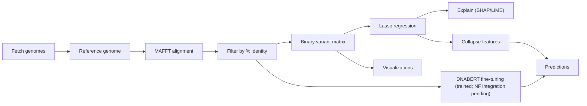

# SARS-CoV-2 Case Fatality Rate (CFR) Prediction Pipeline


A production-ready, reproducible pipeline for predicting COVID-19 variant-specific case fatality rates. Built with **Nextflow DSL2**, containerized with **Docker**, and deployable on **AWS Batch/ECS**.

**Status: v1.0 (Aug 2025) — Core pipeline shipped with AWS Batch distributed scoring, interpretable Lasso baseline, robustness + explainability. DNABERT model trained (standalone); Nextflow integration pending.**

---

## 📌 Features
- **End-to-end workflow**: Fetch genomes → align (MAFFT) → build mutation features → train ML models → explain results.
- **Classical ML**: L1-regularized Lasso regression for interpretable, sparse mutation features.
- **Deep learning baseline (trained; NF integration pending)**: DNABERT fine-tuning module (TensorFlow).
- **Robustness checks**: Label permutations, feature shuffles, ablations.
- **Explainability**: SHAP/LIME for mutation-level interpretation.
- **Scalability**: Nextflow orchestration with AWS Batch for parallel execution.
- **Observability**: Centralized logging & metrics with **Amazon CloudWatch** (Logs, Metrics, Alarms, Insights).
- **Productionization**: CI/CD (GitHub Actions → Docker/ECR), MLflow/DVC for versioning (planned), FastAPI service on ECS Fargate (planned), S3 pre-signed I/O + SQS (planned), drift reports (planned).

---

## 🗂️ Repository Layout
```
project/
├─ raw_data/                       # Reference genomes & annotations
├─ transformed_data/               # Input FASTAs
├─ preprocessed_full/              # Alignments, filters, variant matrices
├─ lasso_training_data/            # Train/test feature matrices
├─ dnabert_cfr_regressor.../       # Saved models + scalers + DNABERT weights + tokenizers
├─ models/                         # Lasso model + scaler
├─ explanations/                   # SHAP/LIME + robustness outputs
├─ collapsed_prediction/           # Predictions for new genomes
├─ figures/                        # Visualizations + diagrams (add productionization.png here)
├─ scripts/                        # Python utilities & CLI tools
├─ Dockerfile.lasso                # Container for pipeline
├─ environment.yml                 # Conda environment
├─ requirements.txt                # pip requirements
├─ main.nf                         # Nextflow pipeline
└─ nextflow.config                 # Profiles & executor configs
```

> Some scripts assume relative paths (e.g., `../raw_data`). Run from `scripts/` or adjust paths.

---

## 🚀 Quickstart

### Environment
```bash
conda env create -f environment.yml
conda activate covid-lasso-pipeline
# or
pip install -r requirements.txt
```

### End-to-end run (Dockerized)
```bash
nextflow run main.nf -profile docker \
  --samples "transformed_data/variant_samples_small.fasta" \
  --outdir results_nf
```

### Example: Train & Evaluate Lasso
```bash
python scripts/ML_model.py \
  --train-matrix lasso_training_data/feature_matrix_train.csv \
  --test-matrix  lasso_training_data/feature_matrix_test.csv \
  --alpha 0.000174 \
  --out-dir model_artifacts
```

---

## 🧬 Workflow Overview


---

## ⚙️ Productionization
- **CI/CD**: GitHub Actions → build Docker image → push to ECR.
- **Batch scoring**: Run large cohorts on AWS Batch.
- **On-demand inference**: FastAPI microservice on ECS Fargate, exposed via API Gateway (planned).
- **Data exchange**: Pre-signed S3 URLs for secure input/output (planned).
- **Async workflows**: SQS for job orchestration (planned).
- **Observability**: **Amazon CloudWatch** Logs & Metrics with Alarms (job failures, p95 latency, SQS queue depth).
- **Monitoring**: Drift reports for variant distribution shifts (planned).


---

## 📖 Documentation
These are **sections within this README** (not separate files). Use the links to jump to each section:

- [CLI by Stage](#cli-by-stage) — step-by-step scripts  
- [Nextflow entrypoint](#nextflow-entrypoint) — orchestration configs  
- [Docker image](#docker-image) — reproducible container  
- [Troubleshooting](#troubleshooting) — common issues  

---

## CLI by Stage

### 0) Get the reference & annotations
Creates `raw_data/NC_045512.2_sequence.fasta` and a gene table.
```bash
(cd scripts && python Ref_Seq_Import.py)
```

### 1) Subsample FASTA for quick iteration (optional)
Deterministic reservoir subsampling for large datasets.
```bash
(cd scripts && python subsample_fasta.py \
    -i ../transformed_data/variant_samples.fasta \
    -o ../transformed_data/variant_samples_small.fasta \
    -k 250 --seed 42)
```

### 2) Full preprocessing: align → filter → variant matrix
Performs MAFFT alignment, reorders with reference first, filters by % identity, writes identity report, and builds the binary mutation matrix. Also collects rejected samples into `preprocessed_full/rejected/`.
```bash
(cd scripts && python preprocess_all.py \
    --samples ../transformed_data/variant_samples_small.fasta \
    --reference-fasta ../raw_data/NC_045512.2_sequence.fasta \
    --identity-threshold 92 \
    --out-dir ../preprocessed_full \
    --mafft-args --thread -1)
```

### 3) Train & evaluate Lasso
```bash
(cd scripts && python ML_model.py \
    --train-matrix ../lasso_training_data/feature_matrix_train.csv \
    --test-matrix  ../lasso_training_data/feature_matrix_test.csv \
    --alpha 0.000174 \
    --out-dir ../model_artifacts)
```

### 4) Robustness: negative controls & ablations
```bash
(cd scripts && python neg_ctrls_ablations.py \
    --train_csv ../lasso_training_data/feature_matrix_train.csv \
    --test_csv  ../lasso_training_data/feature_matrix_test.csv  \
    --target_col "Global CFR" --id_col SampleID \
    --outdir ../explanations/controls_out \
    --use_lassocv --cv_folds 5 \
    --n_label_perm 200 --n_feat_shuffle 100 \
    --ablate_regex "^S_" "^ORF1ab_" \
    --ablate_list ../key_sites.txt \
    --ablate_topk_coef 50 \
    --save_preds)
```

### 5) Model explanations (SHAP & LIME)
```bash
(cd scripts && python explain_lasso.py \
    --train_csv ../lasso_training_data/feature_matrix_train.csv \
    --test_csv  ../lasso_training_data/feature_matrix_test.csv  \
    --artifacts_dir ../model_artifacts \
    --outdir ../explanations \
    --lime_n 5 --lime_select largest_error --lime_space raw --lime_digits 6)
```

### 6) Collapse and predict on new genomes
```bash
(cd scripts && python collapse_and_predict.py \
    --variant-matrix ../preprocessed_full/variant_binary_matrix.csv \
    --aligned-fasta ../preprocessed_full/aligned_filtered.fasta \
    --reference-id NC_045512.2 \
    --train-feature-matrix ../lasso_training_data/feature_matrix_train.csv \
    --model ../model_artifacts/lasso_model.joblib \
    --scaler ../model_artifacts/scaler.joblib \
    --out-dir ../collapsed_prediction)
```

### 7) Visualizations
```bash
# Heatmap
(cd scripts && python Variant_feature_heatmap.py)
# Regularization curve
(cd scripts && python Regularization.py)
```

### 8) DNABERT baseline (trained; NF integration pending)
Fine-tuned DNABERT regressor has been trained separately; Nextflow module will be added in v1.1.

---

## Nextflow entrypoint
A Nextflow wrapper (`main.nf`) orchestrates the stages above for scalable, parallel execution.

**Typical usage**
```bash
# Local execution
nextflow run main.nf -profile local \
  --samples "transformed_data/variant_samples_small.fasta" \
  --outdir results_nf

# Docker execution (per-process containers)
nextflow run main.nf -profile docker \
  --samples "transformed_data/variant_samples_small.fasta" \
  --outdir results_nf
```

See `nextflow.config` for available profiles (e.g., `local`, `docker`) and tunables like CPUs/memory, container images, and work directory. Override at runtime with `-with-report`, `-with-trace`, `-with-dag flowchart.png`, and resume with `-resume`.

---

## Docker image
Build a runtime with all dependencies for the Lasso pipeline.
```bash
docker build -f Dockerfile.lasso -t cfr-lasso:latest .
docker run --rm -v "$PWD":/work -w /work cfr-lasso:latest \
  python scripts/ML_model.py --help
```
For end-to-end runs, combine with `main.nf -profile docker` and mount MAFFT/data volumes as needed.

---

## 📊 Outputs
- **Model artifacts (Lasso):** `model_artifacts/lasso_model.joblib`, `model_artifacts/scaler.joblib`
- **Model artifacts (DNABERT — trained; NF integration pending):**
  - Weights: `dnabert_cfr_regressor_all_layers_richer_head/` (Keras v3 SavedModel), `model_artifacts/best_model.h5` (HDF5 snapshot)
  - Tokenizer also `dnabert_cfr_regressor_all_layers_richer_head/` containing:
    - `tokenizer_config.json` *(BertTokenizer; model_max_length=512; do_lower_case=false)*
    - `special_tokens_map.json` *([CLS], [SEP], [MASK], [PAD], [UNK])*
    - `vocab.txt` *(4,101 tokens; 6-mers + specials)*
- **Explanations:** SHAP plots, LIME HTMLs, feature importance tables
- **QC reports:** Identity thresholds, rejected sequences
- **Visualizations:** Variant heatmaps, regularization curves
- **Predictions:** Collapsed feature matrices + CFR predictions

---

## 📌 Roadmap

### ✅ Shipped — v1.0 (Aug 2025)
- Nextflow DSL2 orchestration
- Dockerized stages with pinned dependencies
- **AWS Batch** integration for distributed, chunked scoring
- Lasso baseline with bootstrap validation
- Robustness suite (label permutations, feature shuffles, ablations)
- Explainability (SHAP, LIME)
- Visualizations & reports (heatmaps, regularization curves)
- Reproducibility artifacts (models, scalers, run reports)

### 🚧 In Flight — v1.1
- CI/CD (GitHub Actions → build/test mini NF run → push to ECR)
- MLflow experiment tracking + model registry (design complete)
- **Integrate trained DNABERT module into Nextflow pipeline** (optional GPU Batch queue)

### 🔮 Planned Enhancements — v2 (optional)
- FastAPI inference on ECS Fargate behind API Gateway (interactive small-batch)
- Presigned S3 I/O + SQS for async batch submissions
- Drift monitoring job & report
- Streamlit/Gradio dashboard for explanations
- Multi-omics extension (RNA-seq, host genetics)

---

## Troubleshooting
- **CloudWatch Logs Insights**: grep structured JSON logs to find failing chunks quickly. Useful starter query:
```sql
fields @timestamp, @message
| filter level = 'ERROR'
| sort @timestamp desc
| limit 50
```
- **MAFFT not found**: ensure it is installed and on `PATH`.
- **Path errors**: some scripts assume execution from `scripts/`; either run from there or adjust relative paths.
- **Nextflow var errors**: confirm `main.nf` input channels match declared parameters; use `-with-dag` to inspect graph.
- **CSV parsing**: prefer `awk`/`csvkit` for large files; ensure correct delimiters (`,` for CSV, `\t` for TSV).
- **I/O-bound runs**: consider enabling Fusion S3 streaming or using local ephemeral storage for heavy intermediates.

---

## 📜 License
Apache-2.0.
