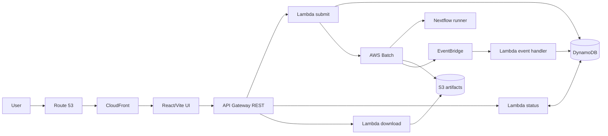
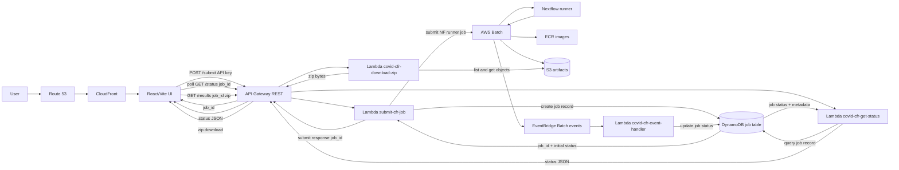
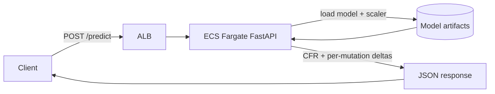
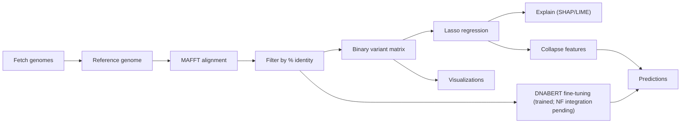

# SARS-CoV-2 CFR Prediction Platform (Genomes → Risk Scores)


[](https://github.com/achandrasek6/Covid-Mortality-Prediction/actions/workflows/deploy-ui.yml)
[](https://github.com/achandrasek6/Covid-Mortality-Prediction/actions/workflows/ecr-push-fastapi.yml)
[](https://github.com/achandrasek6/Covid-Mortality-Prediction/actions/workflows/ecr-push-runner.yml)

**Live demo:** https://www.covid-cfr-predictor.com/ *(API key required — email achandrasek6@gmail.com for access)*

A cloud-native, reproducible system that predicts **variant-specific COVID-19 case-fatality rates (CFR)** from viral genomes. It includes (1) a **public demo UI** for end-to-end CFR prediction from genome sequences and (2) a **low-latency FastAPI “calculator” service** that returns an overall CFR prediction plus **per-mutation delta contributions** from mutation JSON inputs. Both services submit work to a shared compute plane orchestrated with **Nextflow DSL2** and executed in containers on **AWS Batch** (with images published to **ECR**).

**Availability**
- **Demo UI:** public domain via CloudFront/Route 53 → API Gateway → Lambda (API key required)
- **Calculator API:** FastAPI on ECS Fargate behind an internet-facing ALB, restricted to an allowlisted IP (dev-only)

**Status: v2.0 (Jan 7, 2026) — Public UI demo shipped; DNABERT GPU integration planned; RAG-powered natural-language interface for the calculator planned.**

---

## 🧭 Architecture Overview

The platform has two entrypoints (UI demo + FastAPI calculator) that share a common compute plane (**Nextflow on AWS Batch**) and shared storage/metadata.

### Service A — Public Demo UI (API-key gated submit, async jobs)
- **Route 53 domain → CloudFront → React/Vite UI**
- UI calls a **REST API Gateway**:
  - `POST /submit` *(API key required)*: creates a DynamoDB job record and submits the **top-level Nextflow runner** as an **AWS Batch job** (stores `batch_job_id`)
  - `GET /status/{job_id}`: reads **DynamoDB** (source of truth) and returns status plus result links (presigned URLs for `predictions.csv` / `failures.csv`)
  - `GET /results/{job_id}/zip`: streams all S3 artifacts under the job `outdir` into an in-memory ZIP and returns it as a base64 response for browser download
- **AWS Batch job state change events → EventBridge → `covid-cfr-event-handler` Lambda**, which updates the DynamoDB status for the matching `batch_job_id`.
- Nextflow executes containerized stages on **AWS Batch** using images in **ECR** and writes artifacts to **S3**.


```mermaid
flowchart LR;
  U[User] --> R53[Route 53] --> CF[CloudFront] --> UI[React/Vite UI];

  UI --> APIGW[API Gateway REST];
  APIGW --> LSUB[Lambda submit];
  APIGW --> LSTAT[Lambda status];
  APIGW --> LZIP[Lambda download];

  LSUB --> DDB[(DynamoDB)];
  LSTAT <--> DDB;

  LSUB --> BATCH[AWS Batch];
  BATCH --> NF[Nextflow runner];
  BATCH --> S3[(S3 artifacts)];
  BATCH --> EB[EventBridge];
  EB --> LEVT[Lambda event handler];
  LEVT --> DDB;

  LZIP --> S3;
```

<details> <summary><strong>Detailed request flow (submit → status polling → download)</strong></summary>


```mermaid
flowchart LR;
  U[User];
  R53[Route 53];
  CF[CloudFront];
  UI[React/Vite UI];
  APIGW[API Gateway REST];

  LSUB[Lambda submit-cfr-job];
  LSTAT[Lambda covid-cfr-get-status];
  LZIP[Lambda covid-cfr-download-zip];
  LEVT[Lambda covid-cfr-event-handler];

  DDB[(DynamoDB job table)];
  BATCH[AWS Batch];
  NF[Nextflow runner];
  ECR[ECR images];
  S3[(S3 artifacts)];
  EB[EventBridge Batch events];

  U --> R53;
  R53 --> CF;
  CF --> UI;

  %% Submit endpoint (create job + launch compute)
  UI -->|POST /submit API key| APIGW;
  APIGW --> LSUB;
  LSUB -->|create job record| DDB;
  DDB -->|job_id + initial status| LSUB;
  LSUB -->|submit NF runner job| BATCH;
  LSUB -->|submit response job_id| APIGW;
  APIGW -->|job_id| UI;

  %% Compute plane
  BATCH --> NF;
  NF --> BATCH;
  BATCH --> ECR;
  BATCH --> S3;

  %% Batch events update Dynamo status
  BATCH --> EB;
  EB --> LEVT;
  LEVT -->|update job status| DDB;

  %% Status endpoint (polling)
  UI -->|poll GET /status job_id| APIGW;
  APIGW --> LSTAT;
  LSTAT -->|query job record| DDB;
  DDB -->|job status + metadata| LSTAT;
  LSTAT -->|status JSON| APIGW;
  APIGW -->|status JSON| UI;

  %% Download results ZIP (served by Lambda)
  UI -->|GET /results job_id zip| APIGW;
  APIGW --> LZIP;
  LZIP -->|list and get objects| S3;
  LZIP -->|zip bytes| APIGW;
  APIGW -->|zip download| UI;
```

</details>

### Service B — FastAPI Calculator (private, low-latency)

A FastAPI service for interactive “what-if” analysis. Given a mutation JSON payload, it returns:
- an **overall CFR prediction**
- **per-mutation delta contributions** (per genomic index / feature), showing how each mutation shifts the prediction

**Endpoint**
- `POST /predict` — computes CFR and a per-feature delta breakdown for the provided mutation set.
- `GET /features` — lists the Lasso feature set (mutation-derived feature names)
- `GET /health` — health check (used for monitoring / load balancer checks)

**Deployment / access**
- **ALB (internet-facing) → ECS Fargate (FastAPI)**
- Currently **restricted to an allowlisted IP** (dev-only); endpoint is not published


```mermaid
flowchart LR;
  C[Client];
  ALB[ALB];
  ECS[ECS Fargate FastAPI];
  ART[(Model artifacts)];
  RESP[JSON response];

  C -->|POST /predict| ALB;
  ALB --> ECS;

  ECS -->|load model + scaler| ART;
  ART --> ECS;

  ECS -->|CFR + per-mutation deltas| RESP;
  RESP --> C;
```

---

## 🧩 Services

This repo ships two user-facing services that share the same model artifacts and AWS compute plane (Nextflow on AWS Batch).

### Service A — Public Demo UI (async genome scoring)

Live demo: [https://www.covid-cfr-predictor.com/](https://www.covid-cfr-predictor.com/)
API key required for `POST /submit`. Contact: [achandrasek6@gmail.com](mailto:achandrasek6@gmail.com)

**What it does**

* Accepts **one or more FASTA files**.
* Each FASTA file may contain **one genome or many genomes** (multi-FASTA is supported).
* Returns **per-genome CFR predictions** plus downloadable artifacts (CSV + logs/aux outputs).

**API (REST)**

* `POST /submit` *(API key required)* — submits one or more FASTA inputs (files may be multi-FASTA); returns `job_id`
* `GET /status/{job_id}` — polls job status and returns per-sample result links (presigned URLs)
* `GET /results/{job_id}/zip` — downloads a ZIP of all output artifacts for the job

**Execution model**

* Asynchronous job flow: submit → poll status → download results ZIP
* Compute is executed by **Nextflow on AWS Batch**, with container images in **ECR** and artifacts in **S3**; job state is tracked in **DynamoDB**

<details>
<summary><strong>Inputs / outputs (example)</strong></summary>


</details>

### Service B — FastAPI Calculator (private, low-latency)

A FastAPI service for interactive “what-if” analysis on mutation sets. Deployed, but currently **not public** (ALB is internet-facing and IP allowlisted).

**Endpoints**

* `POST /predict` — returns an overall CFR prediction plus per-mutation delta contributions from a mutation JSON payload
* `GET /features` — lists the mutation-derived feature set used by the Lasso model
* `GET /health` — service health check (used for monitoring / load balancer checks)

**Execution model**

* Low-latency inference for small inputs
* Shares the same model artifacts; heavier workflows can be delegated to Nextflow/AWS Batch when needed

<details>
<summary><strong>Inputs / outputs (example)</strong></summary>

**Example request payloads**

```bash
cat > /tmp/example.json <<'JSON'
{
  "sample_id": "example",
  "features": {
    "S_3527": 1,
    "S_645": 1,
    "ORF1ab_2428": 1,
    "S_1451": 1,
    "S_571": 1,
    "S_53": 1,
    "ORF1ab_469": 1,
    "ORF1ab_11809": 1
  }
}
JSON
```

**Call `/predict`**

```bash
curl -sS -X POST $BASE/predict \
  -H 'Content-Type: application/json' \
  --data-binary @/tmp/example.json | jq .
```

**Example response**

```json
{
  "sample_id": "example",
  "cfr_pred": 0.04987867788348602,
  "cfr_pred_pct": "4.99%",
  "model": "Lasso",
  "version": "v1",
  "top_features": [
    {
      "feature": "ORF1ab_11809",
      "coef": 0.0002988483282241131,
      "contribution": 0.006047544671233004
    }
  ],
  "feature_file_sha": "3558a4265054"
}

```

</details>


## 📖 Documentation

Use these quick links to jump around this README:

- [🔬 Results at a Glance](#-results-at-a-glance)
- [📈 Key Figures](#-key-figures)
- [⚡ TL;DR](#-tldr)
- [📌 Features](#-features)
- [🗂️ Repository Layout](#️-repository-layout)
- [🚀 Local Quickstart](#-local-quickstart)
- [🧩 API quickstart (Fargate)](#-api-quickstart-fargate)
- [🧬 Workflow Overview](#-workflow-overview)
- [⚙️ Productionization](#️-productionization)
- [💻 CLI by Stage](#-cli-by-stage)
- [🧭 Nextflow Entrypoint](#-nextflow-entrypoint)
- [📊 Outputs](#-outputs)
- [📌 Roadmap](#-roadmap)
- [🧰 Troubleshooting](#-troubleshooting)
- [📜 License](#-license)

---

## 🧪 Model Development & Validation

This project predicts **variant-specific COVID-19 case-fatality rates (CFR)** from viral genome sequences. The current shipped model is an interpretable **Lasso regression** baseline trained on mutation-derived features. Jobs run in a reproducible compute plane orchestrated with **Nextflow DSL2**, containerized with **Docker**, and executed on **AWS Batch**. A fine-tuned **DNABERT** transformer (6-mer tokenization) is trained as a higher-capacity alternative; optional GPU integration via Nextflow is planned.

**Accuracy (held-out test, Lasso).** **R² = 0.831**, **RMSE ≈ 0.00194**, **MAE ≈ 0.00050**, **Spearman = 0.804**.

**Why it matters**
- **Actionable surveillance:** turns genomes into **variant-level CFR risk scores** for triage, early warning, and prioritizing wet-lab follow-ups.
- **Interpretable by design:** sparse Lasso highlights a compact set of mutation features, enabling mutation-level explanations.
- **Built to scale and reproduce:** Nextflow + Docker + AWS enable consistent runs across environments with pinned dependencies and provenance.

**From metrics to mechanism:** where the signal lives in the genome:


<details>
<summary><strong>How to read this heatmap (and why Spike looks denser)</strong></summary>

<br/>

This heatmap shows the fraction of genomes within each lineage carrying each mutation-derived feature. Columns are grouped and ordered by genomic position—left→right: **ORF1ab (replicase)**, **Spike (S)**, then **Other** (N/M/E + accessory); within each region, features also follow genomic order.

The higher mutation density in Spike likely reflects (i) *positive selection* for host-entry and immune-escape changes (RBD, NTD “antigenic supersite,” S1/S2 cleavage), (ii) *surveillance bias* (Spike-focused reporting/curation), and (iii) *constraint* (replication enzymes in ORF1ab are more constrained, so fewer substitutions persist).

“Prevalence” here indicates how common a feature is within a variant, not its effect size; downstream ablations/SHAP quantify influence. *WildType excluded.*

</details>


### 📈 Key Figures


<details>
<summary><strong>🧱 Lasso: validation + robustness (bootstrap, controls, ablations)</strong></summary>


#### 1) Overall Performance (stability across resamples)

The model’s R² value falls within the 95% bootstrapped confidence interval, indicating that its performance is representative of the underlying distribution rather than a single favorable data split.


#### 2) Robustness Checks (controls)

Both controls show the model isn’t learning artifacts.

| **Label permutations** | **Feature shuffles** |
| --- | --- |
|  |  |
| <sub>Shuffle **labels**: breaks the signal; R² histogram is centered **well below 0**, confirming the model isn’t fitting noise.</sub> | <sub>Shuffle **features** in training only: destroys feature structure; test R² **collapses**, showing real dependence on true features.</sub> |

#### 3) What Genes Matter (group ablations)

Removing the **top-50 |coef|** features yields the largest drop (**ΔR² ≈ −0.033**), validating the coefficient ranking. Dropping **Spike (`^S_`)** features (**ΔR² ≈ −0.025**) and **ORF1ab** (**ΔR² ≈ −0.019**) also harms performance—evidence these genes carry real signal.


</details>

<details>
<summary><strong>🔍 Lasso: explainability (SHAP + LIME examples)</strong></summary>


#### 1) SHAP case studies (model-level explanations)

<table>
  <tr>
    <td width="50%">
      <strong>A. SHAP beeswarm (Lasso baseline)</strong><br/>
      
      <div><em>Each dot is a sample’s SHAP value (units=CFR). Right = ↑CFR, left = ↓CFR. Color: red=present, blue=absent. Saturation: Dark=high density, light=low density</em></div>
    </td>
    <td width="50%">
      <strong>B. Top-10 mean(|SHAP|) features (Lasso baseline)</strong><br/>
      
      <div><em>Average absolute SHAP across the test set—taller bars = more influential features.</em></div>
    </td>
  </tr>
</table>

#### 2) LIME case studies (per-sample explanations)

| **A. High-error case studies** | **B. Per-sample waterfall (MZ314997.2)** |
| --- | --- |
|  |  |
| **What you’re seeing:** Ten high-error genomes against the identity line; the **top-5 absolute errors are labeled** to spotlight where the model deviates (useful for stress-testing explanations). | **What you’re seeing:** Baseline CFR adjusted by the **five largest local contributions** to reach the prediction; dashed line shows **true CFR**. **Right bars raise** the score; **left bars lower** it. |

> **How LIME complements SHAP:**  
> SHAP shows **global patterns** (which features matter overall and in which direction per sample), while **LIME** zooms into **one sample at a time** with a simple surrogate explaining its specific prediction (great for narrative, QA, and debugging outliers).

**Quick takeaways (Lasso baseline):**
- Spike and ORF1ab sites dominate top importance—consistent with group ablations.  
- Beeswarm directionality highlights which alleles **raise vs. lower** predicted CFR, guiding biological follow-up.  
- LIME helps **audit individual genomes** (especially large-error cases) to ensure the model’s rationale is sensible.

</details>

<details>
<summary><strong>🧬 DNABERT: deep model summary (artifacts + trade-offs)</strong></summary>


#### Language model (DNABERT) — quick summary

* Fine-tuned transformer achieved **RMSE = 0.0046**, about **15% lower error** than Lasso in my study, while capturing **long-range sequence context**. **Recommended when maximum accuracy is needed.**
* Useful when you want maximum accuracy and are OK with GPU/latency trade-offs; Lasso remains the fast, interpretable default.
* Artifacts included: SavedModel/weights and tokenizer; NF GPU integration planned so you can toggle `--use_dnabert true`.

| Model                | Strengths                                                | Trade-offs                             | Best for                                                              |
| -------------------- | -------------------------------------------------------- | -------------------------------------- | --------------------------------------------------------------------- |
| **Lasso (baseline)** | Interpretable coefficients; small, fast; easy to explain | May miss non-linear/long-range effects | Routine surveillance, explainability, bulk scoring                    |
| **DNABERT (deep)**   | Captures context; headroom for accuracy                  | GPU needed; slower; less transparent   | High-stakes analyses, research scenarios where extra accuracy matters |

</details>

### ⚡ TL;DR

**Accurate (R² \~0.83), interpretable, and production-ready** genomic risk prediction.
Deep-learning headroom (DNABERT trained) is available; the shipped Lasso baseline already gives strong accuracy with transparent mutation-level insights and real robustness evidence.

<details>
<summary><strong>Bonus: Model parsimony</strong></summary>

An elbow curve shows lasso model performance saturating with a relatively small number of features—useful for **simpler, faster deployments** and easier biological review.


</details>

---


## 📌 Features
- **End-to-end workflow**: Fetch genomes → align (MAFFT) → build mutation features → train ML models → explain results.
- **Classical ML**: L1-regularized Lasso regression for interpretable, sparse mutation features.
- **Deep learning baseline (trained; NF integration pending)**: DNABERT fine-tuning module (TensorFlow).
- **Robustness checks**: Label permutations, feature shuffles, ablations.
- **Explainability**: SHAP/LIME for mutation-level interpretation.
- **Scalability**: Nextflow orchestration with AWS Batch for parallel execution.
- **Observability**: Centralized logging & metrics with **Amazon CloudWatch** (Logs, Metrics, Alarms, Insights).
- **Productionization**: CI/CD (GitHub Actions → Docker/ECR), MLflow/DVC for versioning (planned), FastAPI service on ECS Fargate (planned), S3 pre-signed I/O + SQS (planned), drift reports (planned).

---

## 🗂️ Repository Layout

```
project/
├─ .github/                          # GitHub config (Actions workflows, etc.)
├─ app/                              # FastAPI service (main.py, requirements.txt)
├─ controls_out/                     # Robustness outputs (label perms, shuffles, ablations)
├─ dnabert_cfr_regressor...          # DNABERT weights + tokenizer artifacts
├─ docker/                           # NF container build context (Dockerfile.lasso lives here)
├─ explanations/                     # SHAP/LIME figures, explanation reports
├─ figures/                          # Visualizations & diagrams used in the README/papers
├─ lasso_training_data/              # Train/test feature matrices for Lasso
├─ model_artifacts/                  # Trained models, scalers, checkpoints
├─ raw_data/                         # Reference genomes & annotations
├─ scripts/                          # Python utilities & CLI entrypoints
├─ test_samples/                     # Small FASTA samples for quick runs
├─ transformed_data/                 # Prepared/subsampled input FASTAs
├─ .dockerignore                     # Build context excludes for Docker
├─ .gitignore                        # Git ignore rules
├─ Dockerfile.api                    # API Container build context
├─ CITATION.cff                      # Citation metadata for the project
├─ README.md                         # This documentation
├─ environment.yml                   # Conda environment spec
├─ requirements.txt                  # pip requirements
├─ main.nf                           # Nextflow pipeline entrypoint
└─ nextflow.config                   # Nextflow profiles & executor configs
```

> Some scripts assume relative paths (e.g., `../raw_data`). Run from `scripts/` or adjust paths.

---

## 🚀 Local Quickstart

### Environment
```bash
conda env create -f environment.yml
conda activate covid-lasso-pipeline
# or
pip install -r requirements.txt
```

### Docker Image
Build a runtime with all dependencies for the Lasso pipeline.
```bash
docker build -f Dockerfile.lasso -t covid-lasso:aws-preprocess-fix-20250822-0339 .
docker run --rm -v "$PWD":/work -w /work covid-lasso:aws-preprocess-fix-20250822-0339 \
  python scripts/ML_model.py --help
```
For end-to-end runs, combine with `main.nf -profile docker` and mount MAFFT/data volumes as needed.

### End-to-end run (Dockerized)
```bash
nextflow run main.nf -profile docker \
  --samples "transformed_data/variant_samples_small.fasta" \
  --outdir results_nf
```
>See `nextflow.config` file for full list of arguements.
### Train & Evaluate Lasso
```bash
python scripts/ML_model_CLI_user.py \
  --train-matrix lasso_training_data/feature_matrix_train.csv \
  --test-matrix  lasso_training_data/feature_matrix_test.csv \
  --alpha 0.000174 \
  --out-dir model_artifacts
```
> Run 'extract_features.py' to strip features from training matrix for Nextflow run (see docstring). 

## 🧩 API quickstart (Fargate)

> **Note on URLs (security)**
> This repo doesn’t publish a live endpoint. The ALB DNS you create in AWS is a **public, unauthenticated entry point**. Posting it in a README invites scraping/abuse, noisy logs, and surprise costs.  
> Use a placeholder like `https://<YOUR_API_URL>` here, and deploy behind one of these:
> - **API Gateway → VPC Link → private ALB** (recommended): add API keys/JWT, throttling, custom domain + TLS.
> - **Public ALB** (testing only): restrict Security Group to your IPs, enable TLS (ACM), require `X-API-Key`, attach WAF.
>
> When testing locally, substitute your own URL **without** committing it:
> ```bash
> export API_BASE="https://<YOUR_API_URL>"
> curl -H "X-API-Key: $API_KEY" "$API_BASE/health"
> ```

Replace `<ALB_DNS>` and `<YOUR_API_URL>` with your own when available.

**Predict from inline features**
```bash
curl -X POST http://<ALB_DNS>/predict \
  -H 'Content-Type: application/json' \
  -d '{
    "sample_id":"EX123",
    "features":{"S_1434":1,"ORF1ab_2428":1,"S_645":0}
  }'
```

**Presign an S3 PUT (upload)**
```
curl -X POST http://<ALB_DNS>/presign \
  -H 'Content-Type: application/json' \
  -d '{"key":"uploads/example.fasta","method":"put_object","expires_in":3600}'
```
**Queue a batch job**
```
curl -X POST http://<ALB_DNS>/submit \
  -H 'Content-Type: application/json' \
  -d '{
    "input_s3":"s3://ach-covid-lasso-us-east-2/inputs/batch/*.fasta",
    "output_s3":"s3://ach-covid-lasso-us-east-2/results/batch-001/",
    "params":{"profile":"aws"}
  }'
```
### 🔧 Environment (ECS task)

**Required**
```
AWS_REGION=us-east-2
S3_BUCKET=<your-s3-bucket>                  # e.g., covid-cfr-prod-us-east-2
SQS_QUEUE_URL=https://sqs.<region>.amazonaws.com/<account-id>/<queue-name>
```

**Optional**
```
REQUIRE_API_KEY=true                        # set true to enforce API key auth
API_KEY=<strong-secret-value>               # store in Secrets Manager/Task secrets
MODEL_VERSION=v1
```

---

## 🧬 Workflow Overview

```mermaid
flowchart LR
  A["Fetch genomes"] --> B["Reference genome"]
  B --> C["MAFFT alignment"]
  C --> D["Filter by % identity"]
  D --> E["Binary variant matrix"]
  E --> F["Lasso regression"]
  F --> G["Explain (SHAP/LIME)"]
  D --> H["DNABERT fine-tuning (trained; NF integration pending)"]
  E --> I["Visualizations"]
  F --> J["Collapse features"]
  H --> K["Predictions"]
  J --> K
```

---

## ⚙️ Productionization

- **CI/CD**: GitHub Actions builds `docker/Dockerfile.lasso` and pushes to ECR (`latest` + `<commit_sha>`).
- **Batch scoring**: Run large cohorts on AWS Batch.
- **On-demand inference**: FastAPI microservice on ECS Fargate, exposed via API Gateway (planned).
- **Data exchange**: Pre-signed S3 URLs for secure input/output (planned).
- **Async workflows**: SQS for job orchestration (planned).
- **Observability**: **Amazon CloudWatch** Logs & Metrics with Alarms (job failures, p95 latency, SQS queue depth).
- **Monitoring**: Drift reports for variant distribution shifts (planned).

### CI/CD: GitHub Actions → Docker → AWS ECR (Shipped)

This repo auto-builds a Docker image and pushes it to **Amazon ECR** on every push to `main`.

- **Workflow:** `.github/workflows/ecr-push.yml`
- **Dockerfile:** `docker/Dockerfile.lasso`
- **Registry:** `802861900950.dkr.ecr.us-east-2.amazonaws.com/covid-lasso`
- **Tags pushed:** `:latest` (convenience) and `:<commit_sha>` (immutable)
- **Build cache:** an extra `:buildcache` (or `:cache`) tag is used by Buildx for faster builds.

Pull the image:
```bash
Registry: <account-id>.dkr.ecr.<region>.amazonaws.com/<repo>
...
docker pull <account-id>.dkr.ecr.<region>.amazonaws.com/<repo>:latest
docker pull <account-id>.dkr.ecr.<region>.amazonaws.com/<repo>:<commit_sha>
```

### 🛰️ Deployed API (ECS Fargate + ALB) (Shipped)
Public ALB → FastAPI service on ECS Fargate. Health:
_Currently private_
```bash
curl -H "X-API-Key: $API_KEY" "$API_BASE/health"
# {"status":"ok","time":...}
```

### 🔒 Security 
Endpoints can require an API key (`REQUIRE_API_KEY=true`). S3 access uses presigned URLs scoped to allowed prefixes; SQS messages are JSON-validated server side. CI uses AWS OIDC (no long-lived keys).

---


## 💻 CLI by Stage

### 0) Get the reference & annotations
Creates `raw_data/NC_045512.2_sequence.fasta` and a gene table.
```bash
(cd scripts && python Ref_Seq_Import.py)
```

### 1) Subsample FASTA for quick iteration (optional)
Deterministic reservoir subsampling for large datasets.
```bash
(cd scripts && python subsample_fasta.py \
    -i ../transformed_data/variant_samples.fasta \
    -o ../transformed_data/variant_samples_small.fasta \
    -k 250 --seed 42)
```

### 2) Full preprocessing: align → filter → variant matrix
Performs MAFFT alignment, reorders with reference first, filters by % identity, writes identity report, and builds the binary mutation matrix. Also collects rejected samples into `preprocessed_full/rejected/`.
```bash
(cd scripts && python preprocess_all.py \
    --samples ../transformed_data/variant_samples_small.fasta \
    --reference-fasta ../raw_data/NC_045512.2_sequence.fasta \
    --identity-threshold 92 \
    --out-dir ../preprocessed_full \
    --mafft-args --thread -1)
```

### 3) Train & evaluate Lasso
```bash
(cd scripts && python ML_model.py \
    --train-matrix ../lasso_training_data/feature_matrix_train.csv \
    --test-matrix  ../lasso_training_data/feature_matrix_test.csv \
    --alpha 0.000174 \
    --out-dir ../model_artifacts)
```

### 4) Robustness: negative controls & ablations
```bash
(cd scripts && python neg_ctrls_ablations.py \
    --train_csv ../lasso_training_data/feature_matrix_train.csv \
    --test_csv  ../lasso_training_data/feature_matrix_test.csv  \
    --target_col "Global CFR" --id_col SampleID \
    --outdir ../explanations/controls_out \
    --use_lassocv --cv_folds 5 \
    --n_label_perm 200 --n_feat_shuffle 100 \
    --ablate_regex "^S_" "^ORF1ab_" \
    --ablate_list ../key_sites.txt \
    --ablate_topk_coef 50 \
    --save_preds)
```

### 5) Model explanations (SHAP & LIME)
```bash
(cd scripts && python explain_lasso.py \
    --train_csv ../lasso_training_data/feature_matrix_train.csv \
    --test_csv  ../lasso_training_data/feature_matrix_test.csv  \
    --artifacts_dir ../model_artifacts \
    --outdir ../explanations \
    --lime_n 5 --lime_select largest_error --lime_space raw --lime_digits 6)
```

### 6) Collapse and predict on new genomes
```bash
(cd scripts && python collapse_and_predict.py \
    --variant-matrix ../preprocessed_full/variant_binary_matrix.csv \
    --aligned-fasta ../preprocessed_full/aligned_filtered.fasta \
    --reference-id NC_045512.2 \
    --train-feature-matrix ../lasso_training_data/feature_matrix_train.csv \
    --model ../model_artifacts/lasso_model.joblib \
    --scaler ../model_artifacts/scaler.joblib \
    --out-dir ../collapsed_prediction)
```

### 7) Visualizations
```bash
# Heatmap
(cd scripts && python Variant_feature_heatmap.py)
# Regularization curve
(cd scripts && python Regularization.py)
```

### 8) DNABERT baseline (trained; NF integration pending)
Fine-tuned DNABERT regressor has been trained separately; Nextflow module will be added in v1.1.

---

## 🧭 Nextflow Entrypoint
A Nextflow wrapper (`main.nf`) orchestrates the stages above for scalable, parallel execution.

**Typical usage**
```bash
# Local execution
nextflow run main.nf -profile local \
  --samples "transformed_data/variant_samples_small.fasta" \
  --outdir results_nf

# Docker execution (per-process containers)
nextflow run main.nf -profile docker \
  --samples "transformed_data/variant_samples_small.fasta" \
  --outdir results_nf

# AWS Batch execution (cloud computing)
nextflow run main.nf -profile aws \
--samples "s3://<your-bucket>/inputs/test_samples/*.fasta"
--outdir "s3://<your-bucket>/results_test"
```

See `nextflow.config` for available profiles (e.g., `local`, `docker`), full list of CLI args and tunables like CPUs/memory, container images, and work directory. Override at runtime with `-with-report`, `-with-trace`, `-with-dag flowchart.png`, and resume with `-resume`.

---

## 📊 Outputs
- **Model artifacts (Lasso):** `model_artifacts/lasso_model.joblib`, `model_artifacts/scaler.joblib`
- **Model artifacts (DNABERT — trained; NF integration pending):**
  - Weights: `dnabert_cfr_regressor_all_layers_richer_head/` (Keras v3 SavedModel), `model_artifacts/best_model.h5` (HDF5 snapshot)
  - Tokenizer also `dnabert_cfr_regressor_all_layers_richer_head/` containing:
    - `tokenizer_config.json` *(BertTokenizer; model_max_length=512; do_lower_case=false)*
    - `special_tokens_map.json` *([CLS], [SEP], [MASK], [PAD], [UNK])*
    - `vocab.txt` *(4,101 tokens; 6-mers + specials)*
- **Explanations:** SHAP plots, LIME HTMLs, feature importance tables
- **QC reports:** Identity thresholds, rejected sequences
- **Visualizations:** Variant heatmaps, regularization curves
- **Predictions:** Collapsed feature matrices + CFR predictions

---

## 📌 Roadmap

### ✅ Shipped — v1.1 (Sep 2025)
- Nextflow DSL2 orchestration
- Dockerized stages with pinned dependencies
- **AWS Batch** integration for distributed, chunked scoring
- **FastAPI microservice on ECS Fargate (ALB)** — `/health`, `/predict` (stub), `/presign` (S3 presigned URLs), `/submit` (enqueue to SQS)
- CI/CD: GitHub Actions (OIDC) → Docker Buildx → **Amazon ECR** (immutable `:<commit_sha>` + `:latest`)
- Lasso baseline with bootstrap validation
- Robustness suite (label permutations, feature shuffles, ablations)
- Explainability (SHAP, LIME)
- Visualizations & reports (heatmaps, regularization curves)
- Reproducibility artifacts (models, scalers, run reports)

### 🚧 In Flight — v1.2
- **API Gateway + auth/rate limits** in front of Fargate (private ALB via VPC Link)
- MLflow experiment tracking + model registry (design complete)
- Wire real model artifacts into `/predict` (scaler + Lasso), improve schema validation
- **Integrate trained DNABERT module into Nextflow** (optional GPU Batch queue)

### 🔮 Planned Enhancements — v2 (optional)
- **Presigned S3 I/O + SQS**: end-to-end async batch (worker consumer + status)
- Drift monitoring job & report (feature/label distribution shifts)
- Streamlit/Gradio dashboard for explanations
- Multi-omics extension (RNA-seq, host genetics)

---

## 🧰 Troubleshooting
- **CloudWatch Logs Insights**: grep structured JSON logs to find failing chunks quickly. Useful starter query:
```sql
fields @timestamp, @message
| filter level = 'ERROR'
| sort @timestamp desc
| limit 50
```
- **MAFFT not found**: ensure it is installed and on `PATH`.
- **Path errors**: some scripts assume execution from `scripts/`; either run from there or adjust relative paths.
- **Nextflow var errors**: confirm `main.nf` input channels match declared parameters; use `-with-dag` to inspect graph.
- **CSV parsing**: prefer `awk`/`csvkit` for large files; ensure correct delimiters (`,` for CSV, `\t` for TSV).
- **I/O-bound runs**: consider enabling Fusion S3 streaming or using local ephemeral storage for heavy intermediates.

---

## 📜 License
Apache-2.0.
