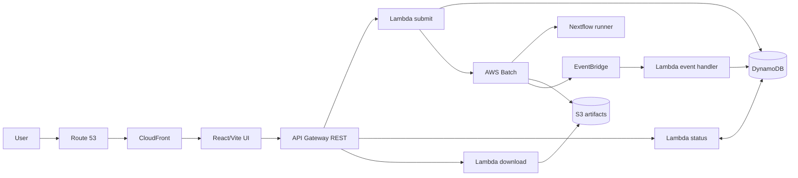
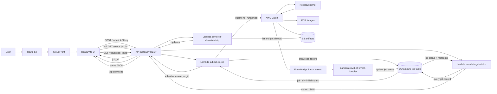
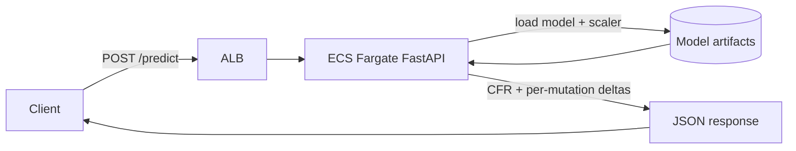
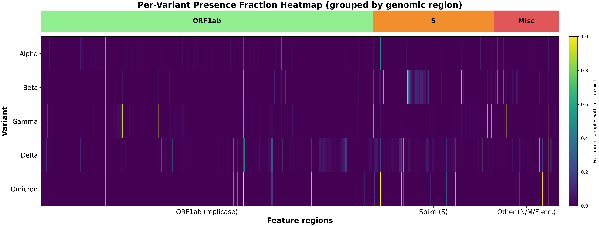
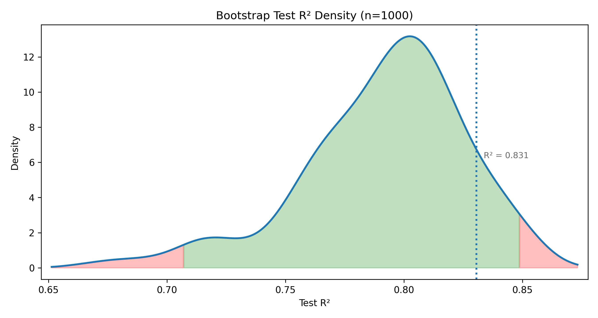
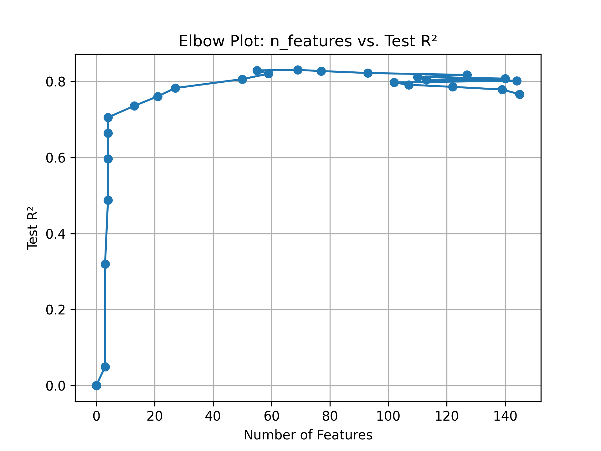

# SARS-CoV-2 CFR Prediction Platform (Genomes → Risk Scores)


[](https://github.com/achandrasek6/Covid-Mortality-Prediction/actions/workflows/deploy-ui.yml)
[](https://github.com/achandrasek6/Covid-Mortality-Prediction/actions/workflows/ecr-push-fastapi.yml)
[](https://github.com/achandrasek6/Covid-Mortality-Prediction/actions/workflows/ecr-push-runner.yml)

**Live demo:** https://www.covid-cfr-predictor.com/ *(API key required — email achandrasek6@gmail.com for access)*

A cloud-native, reproducible system that predicts **variant-specific COVID-19 case-fatality rates (CFR)** from viral genomes. It includes (1) a **public demo UI** for end-to-end CFR prediction from genome sequences and (2) a **low-latency FastAPI “calculator” service** that returns an overall CFR prediction plus **per-mutation delta contributions** from mutation JSON inputs. Both services submit work to a shared compute plane orchestrated with **Nextflow DSL2** and executed in containers on **AWS Batch** (with images published to **ECR**).

**Availability**
- **Demo UI:** public domain via CloudFront/Route 53 → API Gateway → Lambda (API key required)
- **Calculator API:** FastAPI on ECS Fargate behind an internet-facing ALB, restricted to an allowlisted IP (dev-only)

**Status: v2.0 (Jan 7, 2026) — Public UI demo shipped; DNABERT GPU integration planned; RAG-powered natural-language interface for the calculator planned.**

**Bonus:** includes a COVID-19 patient transcriptomics analysis (DGE + pathway insights) at the end of this README.

---

## 📖 Table of Contents

Use these quick links to jump around this README:

- [🔬 Results at a Glance](#-results-at-a-glance)
- [📈 Key Figures](#-key-figures)
- [⚡ TL;DR](#-tldr)
- [📌 Features](#-features)
- [🗂️ Repository Layout](#️-repository-layout)
- [🚀 Local Quickstart](#-local-quickstart)
- [🧩 API quickstart (Fargate)](#-api-quickstart-fargate)
- [🧬 Workflow Overview](#-workflow-overview)
- [⚙️ Productionization](#️-productionization)
- [💻 CLI by Stage](#-cli-by-stage)
- [🧭 Nextflow Entrypoint](#-nextflow-entrypoint)
- [📊 Outputs](#-outputs)
- [📌 Roadmap](#-roadmap)
- [🧰 Troubleshooting](#-troubleshooting)
- [📜 License](#-license)

---

## 🧭 Architecture Overview

The platform has two entrypoints (UI demo + FastAPI calculator) that share a common compute plane (**Nextflow on AWS Batch**) and shared storage/metadata.

### 🌐 Service A — Public Demo UI (API-key gated submit, async jobs)
- **Route 53 domain → CloudFront → React/Vite UI**
- UI calls a **REST API Gateway**:
  - `POST /submit` *(API key required)*: creates a DynamoDB job record and submits the **top-level Nextflow runner** as an **AWS Batch job** (stores `batch_job_id`)
  - `GET /status/{job_id}`: reads **DynamoDB** (source of truth) and returns status plus result links (presigned URLs for `predictions.csv` / `failures.csv`)
  - `GET /results/{job_id}/zip`: streams all S3 artifacts under the job `outdir` into an in-memory ZIP and returns it as a base64 response for browser download
- **AWS Batch job state change events → EventBridge → `covid-cfr-event-handler` Lambda**, which updates the DynamoDB status for the matching `batch_job_id`.
- Nextflow executes containerized stages on **AWS Batch** using images in **ECR** and writes artifacts to **S3**.


```mermaid
flowchart LR;
  U[User] --> R53[Route 53] --> CF[CloudFront] --> UI[React/Vite UI];

  UI --> APIGW[API Gateway REST];
  APIGW --> LSUB[Lambda submit];
  APIGW --> LSTAT[Lambda status];
  APIGW --> LZIP[Lambda download];

  LSUB --> DDB[(DynamoDB)];
  LSTAT <--> DDB;

  LSUB --> BATCH[AWS Batch];
  BATCH --> NF[Nextflow runner];
  BATCH --> S3[(S3 artifacts)];
  BATCH --> EB[EventBridge];
  EB --> LEVT[Lambda event handler];
  LEVT --> DDB;

  LZIP --> S3;
```

<details> <summary><strong>Detailed request flow (submit → status polling → download)</strong></summary>


```mermaid
flowchart LR;
  U[User];
  R53[Route 53];
  CF[CloudFront];
  UI[React/Vite UI];
  APIGW[API Gateway REST];

  LSUB[Lambda submit-cfr-job];
  LSTAT[Lambda covid-cfr-get-status];
  LZIP[Lambda covid-cfr-download-zip];
  LEVT[Lambda covid-cfr-event-handler];

  DDB[(DynamoDB job table)];
  BATCH[AWS Batch];
  NF[Nextflow runner];
  ECR[ECR images];
  S3[(S3 artifacts)];
  EB[EventBridge Batch events];

  U --> R53;
  R53 --> CF;
  CF --> UI;

  %% Submit endpoint (create job + launch compute)
  UI -->|POST /submit API key| APIGW;
  APIGW --> LSUB;
  LSUB -->|create job record| DDB;
  DDB -->|job_id + initial status| LSUB;
  LSUB -->|submit NF runner job| BATCH;
  LSUB -->|submit response job_id| APIGW;
  APIGW -->|job_id| UI;

  %% Compute plane
  BATCH --> NF;
  NF --> BATCH;
  BATCH --> ECR;
  BATCH --> S3;

  %% Batch events update Dynamo status
  BATCH --> EB;
  EB --> LEVT;
  LEVT -->|update job status| DDB;

  %% Status endpoint (polling)
  UI -->|poll GET /status job_id| APIGW;
  APIGW --> LSTAT;
  LSTAT -->|query job record| DDB;
  DDB -->|job status + metadata| LSTAT;
  LSTAT -->|status JSON| APIGW;
  APIGW -->|status JSON| UI;

  %% Download results ZIP (served by Lambda)
  UI -->|GET /results job_id zip| APIGW;
  APIGW --> LZIP;
  LZIP -->|list and get objects| S3;
  LZIP -->|zip bytes| APIGW;
  APIGW -->|zip download| UI;
```

</details>

### 🧮 Service B — FastAPI Calculator (private, low-latency)

A FastAPI service for interactive “what-if” analysis. Given a mutation JSON payload, it returns:
- an **overall CFR prediction**
- **per-mutation delta contributions** (per genomic index / feature), showing how each mutation shifts the prediction

**Endpoint**
- `POST /predict` — computes CFR and a per-feature delta breakdown for the provided mutation set.
- `GET /features` — lists the Lasso feature set (mutation-derived feature names)
- `GET /health` — health check (used for monitoring / load balancer checks)

**Deployment / access**
- **ALB (internet-facing) → ECS Fargate (FastAPI)**
- Currently **restricted to an allowlisted IP** (dev-only); endpoint is not published


```mermaid
flowchart LR;
  C[Client];
  ALB[ALB];
  ECS[ECS Fargate FastAPI];
  ART[(Model artifacts)];
  RESP[JSON response];

  C -->|POST /predict| ALB;
  ALB --> ECS;

  ECS -->|load model + scaler| ART;
  ART --> ECS;

  ECS -->|CFR + per-mutation deltas| RESP;
  RESP --> C;
```

---

## 🧩 Services

This repo ships two user-facing services that share the same model artifacts and AWS compute plane (Nextflow on AWS Batch).

### 🌐 Service A — Public Demo UI (async genome scoring)

Live demo: [https://www.covid-cfr-predictor.com/](https://www.covid-cfr-predictor.com/)
API key required for `POST /submit`. Contact: [achandrasek6@gmail.com](mailto:achandrasek6@gmail.com)

**What it does**

* Accepts **one or more FASTA files**.
* Each FASTA file may contain **one genome or many genomes** (multi-FASTA is supported).
* Returns **per-genome CFR predictions** plus downloadable artifacts (CSV + logs/aux outputs).

**API (REST)**

* `POST /submit` *(API key required)* — submits one or more FASTA inputs (files may be multi-FASTA); returns `job_id`
* `GET /status/{job_id}` — polls job status and returns per-sample result links (presigned URLs)
* `GET /results/{job_id}/zip` — downloads a ZIP of all output artifacts for the job

**Execution model**

* Asynchronous job flow: submit → poll status → download results ZIP
* Compute is executed by **Nextflow on AWS Batch**, with container images in **ECR** and artifacts in **S3**; job state is tracked in **DynamoDB**

<details>
<summary><strong>Inputs / outputs (example)</strong></summary>


</details>

### 🧮 Service B — FastAPI Calculator (private, low-latency)

A FastAPI service for interactive “what-if” analysis on mutation sets. Deployed, but currently **not public** (ALB is internet-facing and IP allowlisted).

**Endpoints**

* `POST /predict` — returns an overall CFR prediction plus per-mutation delta contributions from a mutation JSON payload
* `GET /features` — lists the mutation-derived feature set used by the Lasso model
* `GET /health` — service health check (used for monitoring / load balancer checks)

**Execution model**

* Low-latency inference for small inputs
* Shares the same model artifacts; heavier workflows can be delegated to Nextflow/AWS Batch when needed

<details>
<summary><strong>Inputs / outputs (example)</strong></summary>

**Example request payloads**

```bash
cat > /tmp/example.json <<'JSON'
{
  "sample_id": "example",
  "features": {
    "S_3527": 1,
    "S_645": 1,
    "ORF1ab_2428": 1,
    "S_1451": 1,
    "S_571": 1,
    "S_53": 1,
    "ORF1ab_469": 1,
    "ORF1ab_11809": 1
  }
}
JSON
```

**Call `/predict`**

```bash
curl -sS -X POST $BASE/predict \
  -H 'Content-Type: application/json' \
  --data-binary @/tmp/example.json | jq .
```

**Example response**

```json
{
  "sample_id": "example",
  "cfr_pred": 0.04987867788348602,
  "cfr_pred_pct": "4.99%",
  "model": "Lasso",
  "version": "v1",
  "top_features": [
    {
      "feature": "ORF1ab_11809",
      "coef": 0.0002988483282241131,
      "contribution": 0.006047544671233004
    }
  ],
  "feature_file_sha": "3558a4265054"
}

```

</details>

---

## 🔐 Access & Security

**🌐 Demo UI (Service A)**
- The UI is publicly reachable at https://www.covid-cfr-predictor.com/.
- The backend REST API enforces an **API key on `POST /submit`** to control usage and costs.
- **Custom file upload is disabled** in the public demo to prevent unintended use/abuse; the UI is intended for controlled/demo inputs.
- Read-only endpoints (`GET /status/{job_id}`, `GET /results/{job_id}/zip`) are not API-key gated and return only job-scoped artifacts.

**🧮 Calculator API (Service B)**
- The FastAPI service is deployed behind an internet-facing ALB but is currently **restricted to an allowlisted IP** (dev-only).
- The endpoint is not published; access can be granted on request.

**Operational guardrails**
- **DynamoDB is the status source of truth**; **AWS Batch events** update job state.
- Result access is **job-scoped**: status returns **presigned artifact links**; `/zip` returns a **job output bundle**.
- No secrets or live endpoints are committed; request demo access via **achandrasek6@gmail.com**.

---

## 📦 Outputs

### 🌐 Service A (Demo UI / Batch scoring)
Outputs are written to S3 under the job `outdir` as:

- **Quick demo:** `.../<job_id>/variant_samples_tiny/...`
- **Single file demo:** `.../<job_id>/variant_samples_small/...`
- **Multi-file demo:** `.../<job_id>/variant_samples_small/...` and `.../<job_id>/reject_test/...`

You can access results via:
- `GET /status/{job_id}` — returns presigned links for per-sample artifacts (when available)
- `GET /results/{job_id}/zip` — downloads a ZIP of all S3 artifacts under the job prefix

**Per-sample artifacts (typical)**
- `predictions.csv` — per-genome CFR predictions for each sample group (multi-FASTA supported)
- `failures.csv` — rejected genomes / preprocessing failures (empty or omitted when none)

### 🧮 Service B (FastAPI calculator)
`POST /predict` returns a JSON response containing:
- `cfr_pred` (+ formatted string / percent)
- `top_features[]` — feature coefficients and per-feature delta contributions for the provided mutation set
- model metadata (`model`, `version`, `feature_file_sha`)

`GET /features` returns the full list of mutation-derived features used by the Lasso model.

---


## 🗂️ Repository Layout

```
project/
├─ .github/                          # GitHub config (Actions workflows, etc.)
├─ app/                              # FastAPI service (main.py, requirements.txt)
├─ controls_out/                     # Robustness outputs (label perms, shuffles, ablations)
├─ covid-cfr-ui/                     # Frontend UI application
├─ covid-cfr-ui-infra/               # Terraform infrastructure for UI
├─ dnabert_cfr_regressor...          # DNABERT weights + tokenizer artifacts
├─ docker/                           # NF container build context (Dockerfile.lasso lives here)
├─ explanations/                     # SHAP/LIME figures, explanation reports
├─ figures/                          # Visualizations & diagrams used in the README/papers
├─ lasso_training_data/              # Train/test feature matrices for Lasso
├─ model_artifacts/                  # Trained models, scalers, checkpoints
├─ raw_data/                         # Reference genomes & annotations
├─ scripts/                          # Python utilities & CLI entrypoints
├─ test_samples/                     # Small FASTA samples for quick runs
├─ transformed_data/                 # Prepared/subsampled input FASTAs
├─ .dockerignore                     # Build context excludes for Docker
├─ .gitignore                        # Git ignore rules
├─ Dockerfile.api                    # API Container build context
├─ CITATION.cff                      # Citation metadata for the project
├─ README.md                         # This documentation
├─ environment.yml                   # Conda environment spec
├─ requirements.txt                  # pip requirements
├─ main.nf                           # Nextflow pipeline entrypoint
└─ nextflow.config                   # Nextflow profiles & executor configs
```

> Some scripts assume relative paths (e.g., `../raw_data`). Run from `scripts/` or adjust paths.

---


## 🧪 Model Development & Validation

This project predicts **variant-specific COVID-19 case-fatality rates (CFR)** from viral genome sequences. The current shipped model is an interpretable **Lasso regression** baseline trained on mutation-derived features. Jobs run in a reproducible compute plane orchestrated with **Nextflow DSL2**, containerized with **Docker**, and executed on **AWS Batch**. A fine-tuned **DNABERT** transformer (6-mer tokenization) is trained as a higher-capacity alternative; optional GPU integration via Nextflow is planned.

**Accuracy (held-out test, Lasso).** **R² = 0.831**, **RMSE ≈ 0.00194**, **MAE ≈ 0.00050**, **Spearman = 0.804**.

**Why it matters**
- **Actionable surveillance:** turns genomes into **variant-level CFR risk scores** for triage, early warning, and prioritizing wet-lab follow-ups.
- **Interpretable by design:** sparse Lasso highlights a compact set of mutation features, enabling mutation-level explanations.
- **Built to scale and reproduce:** Nextflow + Docker + AWS enable consistent runs across environments with pinned dependencies and provenance.

**From metrics to mechanism:** where the signal lives in the genome:



<details>
<summary><strong>How to read this heatmap (and why Spike looks denser)</strong></summary>

<br/>

This heatmap shows the fraction of genomes within each lineage carrying each mutation-derived feature. Columns are grouped and ordered by genomic position—left→right: **ORF1ab (replicase)**, **Spike (S)**, then **Other** (N/M/E + accessory); within each region, features also follow genomic order.

The higher mutation density in Spike likely reflects (i) *positive selection* for host-entry and immune-escape changes (RBD, NTD “antigenic supersite,” S1/S2 cleavage), (ii) *surveillance bias* (Spike-focused reporting/curation), and (iii) *constraint* (replication enzymes in ORF1ab are more constrained, so fewer substitutions persist).

“Prevalence” here indicates how common a feature is within a variant, not its effect size; downstream ablations/SHAP quantify influence. *WildType excluded.*

</details>


### 📈 Key Figures


<details>
<summary><strong>🧱 Lasso: validation + robustness (bootstrap, controls, ablations)</strong></summary>


#### 1) Overall Performance (stability across resamples)

The model’s R² value falls within the 95% bootstrapped confidence interval, indicating that its performance is representative of the underlying distribution rather than a single favorable data split.



#### 2) Robustness Checks (controls)

Both controls show the model isn’t learning artifacts.

| **Label permutations** | **Feature shuffles** |
| --- | --- |
|  |  |
| <sub>Shuffle **labels**: breaks the signal; R² histogram is centered **well below 0**, confirming the model isn’t fitting noise.</sub> | <sub>Shuffle **features** in training only: destroys feature structure; test R² **collapses**, showing real dependence on true features.</sub> |

#### 3) What Genes Matter (group ablations)

Removing the **top-50 |coef|** features yields the largest drop (**ΔR² ≈ −0.033**), validating the coefficient ranking. Dropping **Spike (`^S_`)** features (**ΔR² ≈ −0.025**) and **ORF1ab** (**ΔR² ≈ −0.019**) also harms performance—evidence these genes carry real signal.


</details>

<details>
<summary><strong>🔍 Lasso: explainability (SHAP + LIME examples)</strong></summary>


#### 1) SHAP case studies (model-level explanations)

<table>
  <tr>
    <td width="50%">
      <strong>A. SHAP beeswarm (Lasso baseline)</strong><br/>
      
      <div><em>Each dot is a sample’s SHAP value (units=CFR). Right = ↑CFR, left = ↓CFR. Color: red=present, blue=absent. Saturation: Dark=high density, light=low density</em></div>
    </td>
    <td width="50%">
      <strong>B. Top-10 mean(|SHAP|) features (Lasso baseline)</strong><br/>
      
      <div><em>Average absolute SHAP across the test set—taller bars = more influential features.</em></div>
    </td>
  </tr>
</table>

#### 2) LIME case studies (per-sample explanations)

| **A. High-error case studies** | **B. Per-sample waterfall (MZ314997.2)** |
| --- | --- |
|  |  |
| **What you’re seeing:** Ten high-error genomes against the identity line; the **top-5 absolute errors are labeled** to spotlight where the model deviates (useful for stress-testing explanations). | **What you’re seeing:** Baseline CFR adjusted by the **five largest local contributions** to reach the prediction; dashed line shows **true CFR**. **Right bars raise** the score; **left bars lower** it. |

> **How LIME complements SHAP:**  
> SHAP shows **global patterns** (which features matter overall and in which direction per sample), while **LIME** zooms into **one sample at a time** with a simple surrogate explaining its specific prediction (great for narrative, QA, and debugging outliers).

**Quick takeaways (Lasso baseline):**
- Spike and ORF1ab sites dominate top importance—consistent with group ablations.  
- Beeswarm directionality highlights which alleles **raise vs. lower** predicted CFR, guiding biological follow-up.  
- LIME helps **audit individual genomes** (especially large-error cases) to ensure the model’s rationale is sensible.

</details>

<details>
<summary><strong>🧬 DNABERT: deep model summary (artifacts + trade-offs)</strong></summary>


#### Language model (DNABERT) — quick summary

* Fine-tuned transformer achieved **RMSE = 0.0046**, about **15% lower error** than Lasso in my study, while capturing **long-range sequence context**. **Recommended when maximum accuracy is needed.**
* Useful when you want maximum accuracy and are OK with GPU/latency trade-offs; Lasso remains the fast, interpretable default.
* Artifacts included: SavedModel/weights and tokenizer; NF GPU integration planned so you can toggle `--use_dnabert true`.

| Model                | Strengths                                                | Trade-offs                             | Best for                                                              |
| -------------------- | -------------------------------------------------------- | -------------------------------------- | --------------------------------------------------------------------- |
| **Lasso (baseline)** | Interpretable coefficients; small, fast; easy to explain | May miss non-linear/long-range effects | Routine surveillance, explainability, bulk scoring                    |
| **DNABERT (deep)**   | Captures context; headroom for accuracy                  | GPU needed; slower; less transparent   | High-stakes analyses, research scenarios where extra accuracy matters |

</details>

### ⚡ TL;DR

**Accurate (R² \~0.83), interpretable, and production-ready** genomic risk prediction.
Deep-learning headroom (DNABERT trained) is available; the shipped Lasso baseline already gives strong accuracy with transparent mutation-level insights and real robustness evidence.

<details>
<summary><strong>Bonus: Model parsimony</strong></summary>

An elbow curve shows lasso model performance saturating with a relatively small number of features—useful for **simpler, faster deployments** and easier biological review.



</details>

---

## 🗺️ Roadmap / Changelog

### ✅ v2 — Jan 7, 2026
- Shipped **public demo UI** on a custom domain (Route 53 + CloudFront) backed by API Gateway + Lambda
- Implemented async job lifecycle with **DynamoDB** (status source of truth) + **EventBridge** (AWS Batch state change events)
- Deployed Nextflow compute plane on **AWS Batch** (runner image + pipeline images in **ECR**), with artifacts written to **S3**
- Added **download flows**:
  - `GET /status/{job_id}` returns presigned artifact links
  - `GET /results/{job_id}/zip` returns a ZIP of all job artifacts
- Deployed **FastAPI calculator** on **ECS Fargate** (ALB, IP allowlisted) with:
  - `POST /predict` (CFR + per-mutation delta contributions)
  - `GET /features`, `GET /health`

### 🚧 Next (planned)
- **DNABERT GPU stage** integrated into Nextflow (optional toggle for higher-capacity inference)
- **RAG-powered natural language interface** for the calculator (ask questions, get grounded answers referencing the model’s feature space)
- Tighten public demo hardening (rate limiting, origin-restricted CORS, additional abuse prevention)

### 📌 Longer-term ideas
- Broaden model/version management (artifact versioning + reproducibility metadata)
- Extended monitoring/reporting for drift and cohort shifts

---


## 🗺️ Roadmap / Changelog

### ✅ v2 — Jan 7, 2026
- Shipped **public demo UI** on a custom domain (Route 53 + CloudFront) backed by API Gateway + Lambda
- Implemented async job lifecycle with **DynamoDB** (status source of truth) + **EventBridge** (AWS Batch state change events)
- Deployed Nextflow compute plane on **AWS Batch** (runner image + pipeline images in **ECR**), with artifacts written to **S3**
- Added download flows:
  - `GET /status/{job_id}` returns presigned artifact links
  - `GET /results/{job_id}/zip` returns a ZIP of all job artifacts
- Deployed **FastAPI calculator** on **ECS Fargate** (ALB, IP allowlisted) with:
  - `POST /predict` (CFR + per-mutation delta contributions)
  - `GET /features`, `GET /health`

### ✅ v1.1 — Sep 2025
- Nextflow DSL2 orchestration and dockerized stages with pinned dependencies
- AWS Batch integration for distributed scoring
- Interpretable **Lasso** baseline with bootstrap validation, robustness controls, and SHAP/LIME explainability
- Visualizations & reports (heatmaps, regularization curves)
- CI/CD: GitHub Actions (OIDC) → Docker Buildx → Amazon ECR (runner + pipeline images)
- DNABERT trained as a standalone artifact (integration pending)

### 🚧 Next (planned)
- **DNABERT GPU stage** integrated into Nextflow (optional toggle for higher-capacity inference)
- **RAG-powered natural language interface** for the calculator (ask questions grounded in the model’s feature space)
- Public demo hardening: rate limiting, origin-restricted CORS, additional abuse prevention
- Calculator API improvements: wire additional artifact/version metadata into responses and tighten schema validation

### 📌 Longer-term ideas
- Artifact/model versioning and reproducibility metadata (e.g., MLflow or equivalent)
- Drift monitoring/reporting for cohort and feature distribution shifts
- Optional UI enhancements for explanations (e.g., lightweight dashboard)
- Multi-omics extensions (host transcriptomics as an additional study/module)

### 🔒 Security (high level)
- The demo API enforces an API key on `POST /submit`; the calculator is restricted to an allowlisted IP (dev-only).
- S3 access is job-scoped via presigned URLs; CI uses AWS OIDC (no long-lived keys).

---

## 🎁 Bonus: COVID-19 patient transcriptomics study (host response)

This section summarizes a small transcriptomics analysis on COVID-19 patient nasopharyngeal samples, stratified by clinical severity (**mild / moderate / severe**). :contentReference[oaicite:0]{index=0}

### What I did (high level)
- Parsed patient metadata from the publication’s supplementary patient table and normalized severity labels (mild/moderate/severe). :contentReference[oaicite:1]{index=1}  
- Pulled differential expression results from the publication’s supplementary “Control_vs_COVID” sheet and used it to generate downstream plots. :contentReference[oaicite:2]{index=2}  
- Built a gene → pathway mapping using KEGG and summarized pathway-level signals. :contentReference[oaicite:3]{index=3}  

<details>
<summary><strong>Key findings + artifacts</strong></summary>

<br/>

### Key findings (from the plots)
- **Inflammation/chemokine signal is prominent**: labeled upregulated genes include **CXCL5, CXCL12, CCL2, CCL4, CXCL10, IFIH1, IFI44, IFIT1, IL6, IL10**. :contentReference[oaicite:4]{index=4}  
- **Downregulated labels skew toward housekeeping/translation-associated genes**, including **RPL41, RPL17, SLC25A6, CALM1, TUBA1A**. :contentReference[oaicite:5]{index=5}  
- Pathway-level patterns mirror the gene-level picture: enriched immune signaling pathways include **Cytokine–cytokine receptor interaction, JAK–STAT, Chemokine signaling, Toll-like receptor, IL-17**, and **Complement and coagulation cascades**, while down-regulated groupings include **Ribosome** and **Oxidative phosphorylation** (among others). :contentReference[oaicite:6]{index=6}  

### Artifacts
- Volcano plot: `cov-19-patient-transcriptomics-study/PLOTS/volcano.pdf` :contentReference[oaicite:7]{index=7}  
- Pathway dot plot: `cov-19-patient-transcriptomics-study/PLOTS/dot_plot.pdf` :contentReference[oaicite:8]{index=8}  

### Reproducible scripts
- `cov-19-patient-transcriptomics-study/CODE/01_data_prep.R` :contentReference[oaicite:9]{index=9}  
- `cov-19-patient-transcriptomics-study/CODE/02_volcano_plot.R` :contentReference[oaicite:10]{index=10}  
- `cov-19-patient-transcriptomics-study/CODE/03_dot_plot.R` :contentReference[oaicite:11]{index=11}  

</details>

---

## 📜 License
Apache-2.0.
