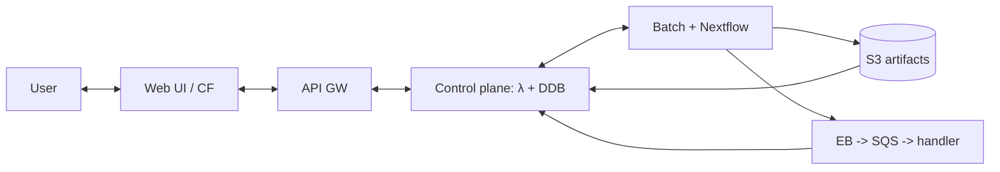
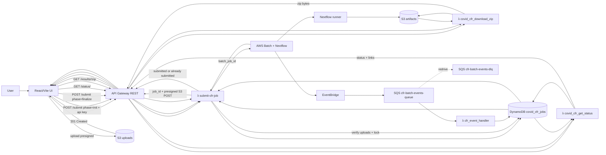
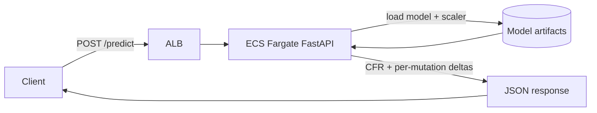
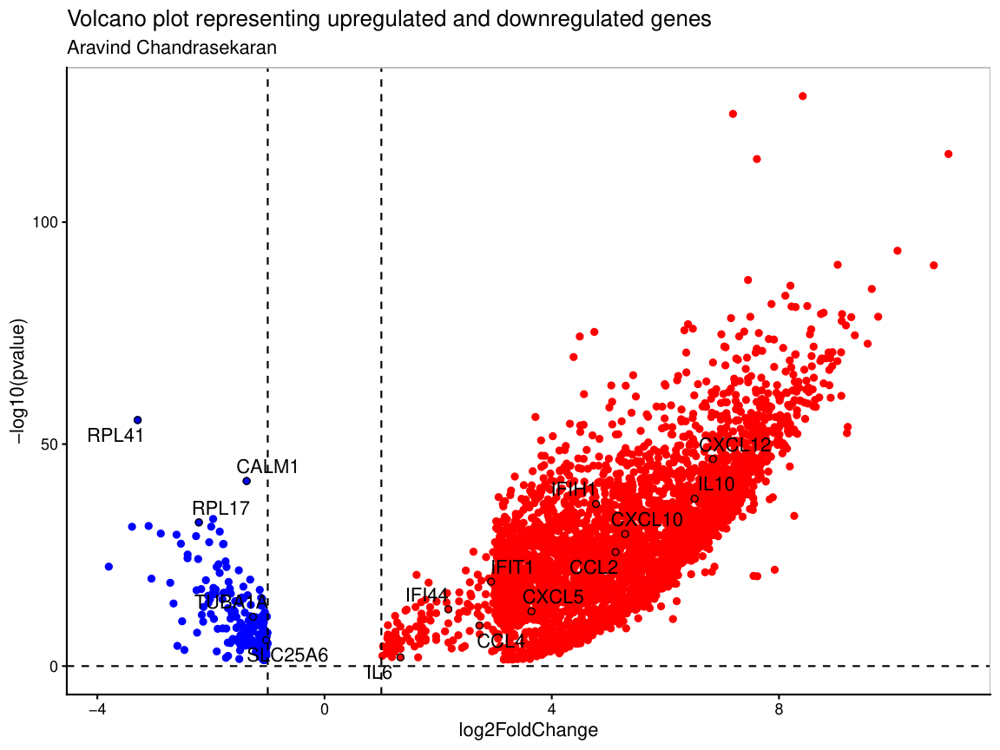
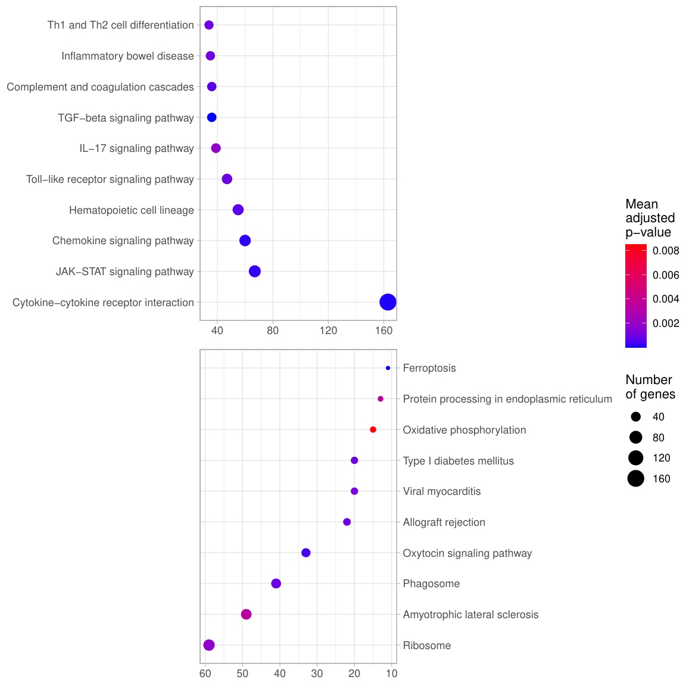

# SARS-CoV-2 CFR Prediction Platform (Genomes → Risk Scores)


[](https://github.com/achandrasek6/Covid-Mortality-Prediction/actions/workflows/deploy-ui.yml)
[](https://github.com/achandrasek6/Covid-Mortality-Prediction/actions/workflows/ecr-push-fastapi.yml)
[](https://github.com/achandrasek6/Covid-Mortality-Prediction/actions/workflows/ecr-push-runner.yml)


🔗 **Live product (gated access):** https://www.covid-cfr-predictor.com/ *(API key required — contact achandrasek6@gmail.com for access)*

A gated-access, multi-tenant genomics scoring service: a hardened **control plane** (**API Gateway**/**Lambda**/**DynamoDB**/**S3 presigns**) that reliably submits and tracks reproducible **Nextflow** pipelines on **AWS Batch**, producing per-genome **case-fatality rate (CFR) predictions** from an interpretable **Lasso** model (with **mutation-level attribution**) and returning **job-scoped artifacts** with guardrails (**idempotency**, **quotas**, **DLQ**, **alarms**, **runbooks**).

**Product surfaces**
- **CFR Scoring Portal (Web, gated access, async scoring):** FASTA/multi-FASTA → per-genome **CFR predictions** + downloadable artifacts (`predictions.csv`, `failures.csv`)
- **CFR What-If Calculator (API, restricted access, low-latency):** mutation JSON → **CFR prediction** computed as **baseline + Σ deltas** + **per-mutation delta attribution**

**Availability**
- **Web UI (gated access)**: Route 53/CloudFront (**Terraform IaC**) → API Gateway (REST) → Lambda (**API key required for submission**)
- **Calculator API:** FastAPI on ECS Fargate behind an internet-facing ALB, restricted to an allowlisted IP (dev-only)

**Status: v2.1 (Jan 2026) — Gated-access product shipped; multi-tenant control plane (API-key→tenant), two-phase submit (init→finalize) with idempotent finalize, durable status propagation (EventBridge→SQS→handler + DLQ) with alarms/runbook; validated control-plane p95 ≈ 223ms @ 10 req/s. DNABERT GPU + NL calculator interface planned.**

**Appendix:** includes a COVID-19 patient transcriptomics analysis (DGE + pathway insights) at the end of this README.

---

## 📖 Table of Contents

- [🧩 Product surfaces](#-product-surfaces)
  - [🌐 CFR Scoring Portal](#-cfr-scoring-portal-web-gated-access-async-jobs)
  - [🧮 CFR What-If Calculator](#-cfr-what-if-calculator-api-restricted-access-low-latency)
- [🧾 What you get](#-what-you-get)
- [✨ Key capabilities](#-key-capabilities)
- [🧭 Architecture overview](#-architecture-overview)
- [🛡️ Reliability, guardrails, and ops](#️-reliability-guardrails-and-ops)
- [🚀 Quickstart (CFR Scoring Portal)](#-quickstart-cfr-scoring-portal)
- [🧰 Troubleshooting (quick)](#-troubleshooting-quick)
- [🔐 Access & security](#-access--security)
- [📦 Results & artifacts](#-results--artifacts)
- [🗂️ Repository layout](#️-repository-layout)
- [🧪 Model development & validation](#-model-development--validation)
  - [📈 Key figures](#-key-figures)
- [🗺️ Roadmap / changelog](#️-roadmap--changelog)
- [🎁 Appendix — Transcriptomics study (host response)](#-appendix--transcriptomics-study-host-response)
- [📚 Citation](#-citation)
- [📜 License](#-license)

---

## 🧩 Product surfaces

This repo ships two user-facing services that share the same model artifacts and AWS compute plane (**Nextflow on AWS Batch**) and return job-scoped outputs stored in **S3** with status tracked in **DynamoDB**.

### 🌐 CFR Scoring Portal (Web, gated access, async jobs)

Live product: [https://www.covid-cfr-predictor.com/](https://www.covid-cfr-predictor.com/)  
**API key required** for submission (`POST /submit`). Contact: [achandrasek6@gmail.com](mailto:achandrasek6@gmail.com)

**What it does**
- Accepts **one or more FASTA files**
- Each FASTA may contain **one genome or many genomes** (multi-FASTA supported)
- Returns **per-genome CFR predictions** plus downloadable artifacts (CSV + logs/aux outputs)

**API (REST)**
- `POST /submit` *(API key required)* — two-phase submission:
  - `phase=init`: creates job row + returns presigned S3 upload(s)
  - `phase=finalize`: verifies uploads + submits Batch (idempotent; safe to retry)
- `GET /status/<job_id>` — polls job status and returns per-sample result links (presigned URLs)
- `GET /results/<job_id>/zip` — downloads a ZIP of all output artifacts for the job

**Execution model**
- Asynchronous flow: **init → upload → finalize → poll status → download ZIP**
- Compute: **Nextflow on AWS Batch** (ECR images), artifacts in **S3**, status source-of-truth in **DynamoDB**


<details>
<summary><strong>Usage (example)</strong></summary>


</details>

### 🧮 CFR What-If Calculator (API, restricted access, low-latency)

A FastAPI service for interactive “what-if” analysis on mutation sets. Given a mutation JSON payload, it returns an overall CFR prediction computed as **baseline CFR + Σ(per-mutation delta)**, along with the per-mutation delta breakdown.

**Endpoints**
- `POST /predict` — returns baseline CFR, per-mutation deltas, and the summed prediction
- `GET /features` — lists the mutation-derived feature set used by the Lasso model
- `GET /health` — service health check (used for monitoring / load balancer checks)

**Execution model**
- Low-latency inference for small inputs; designed for interactive iteration
- Shares the same versioned model/scaler/feature artifacts as the Batch scoring pipeline (response-level bundle/version metadata not yet surfaced)

**Deployment / access**
- **ALB (internet-facing) → ECS Fargate (FastAPI)**
- Currently **restricted to an allowlisted IP**; endpoint is not publicly advertised

<details>
<summary><strong>Usage (example)</strong></summary>

**Example request payloads**

```bash
cat > /tmp/example.json <<'JSON'
{
  "sample_id": "example",
  "features": {
    "S_3527": 1,
    "S_645": 1,
    "ORF1ab_2428": 1,
    "S_1451": 1,
    "S_571": 1,
    "S_53": 1,
    "ORF1ab_469": 1,
    "ORF1ab_11809": 1
  }
}
JSON
```

**Call `/predict`**

```bash
curl -sS -X POST $BASE/predict \
  -H 'Content-Type: application/json' \
  --data-binary @/tmp/example.json | jq .
```

**Example response**

```json
{
  "sample_id": "example",
  "cfr_pred": 0.04987867788348602,
  "cfr_pred_pct": "4.99%",
  "model": "Lasso",
  "version": "v1",
  "top_features": [
    {
      "feature": "ORF1ab_11809",
      "coef": 0.0002988483282241131,
      "contribution": 0.006047544671233004
    }
  ],
  "feature_file_sha": "3558a4265054"
}

```

</details>

---


## 🧾 What you get

### 🧬 Inputs
- **CFR Scoring Portal (genome scoring):** one or more **FASTA / multi-FASTA** files
- **CFR What-If Calculator (what-if scoring):** mutation **JSON** (feature presence/absence)

### 📤 Outputs
- **Per-genome CFR predictions** (CSV) + failures/QC artifacts (CSV) + logs/aux outputs (job-scoped)
- **Downloadable job bundle**: a ZIP of all artifacts for a submission
- **Attribution for what-if analysis**: per-mutation **delta contributions** alongside the overall CFR prediction

### 🔑 Model access
- **Gated access**: submission is **API-key required** and enforced with **tenant-scoped isolation + quotas/guardrails**.
  - _Contact achandrasek6@gmail.com for access._

---

## ✨ Key capabilities

This is a gated-access genomics scoring product built and operated as a service: a multi-tenant control plane that safely accepts submissions, a reproducible Batch/Nextflow compute plane, and observable, idempotent job execution with artifact delivery and ML attribution.

* **Control plane + safety.** API key → tenant mapping (via API Gateway `apiKeyId`), tenant-scoped S3 prefixes, two-phase submit (`init` presign → `finalize` verify+submit), and at-most-once finalize via a conditional lock; quotas are enforced at the gateway and with atomic Dynamo counters (pending uploads / active jobs).  
* **Durable execution + artifacts.** Nextflow runs on AWS Batch; status is propagated through EventBridge → SQS → handler with DLQ redrive; outputs are job-scoped in S3 with presigned links and an on-demand ZIP bundle.  
* **ML + operations.** Interpretable Lasso predictions with mutation-level attribution (what-if deltas), plus structured logs (redacted), saved Logs Insights queries, load tests (k6/vegeta), alarms, runbook, and ADRs in `ops/`.

> Ops docs: [`ops/README.md`](ops/README.md), [`runbook.md`](ops/runbook/runbook.md), [`ops/loadtest/README.md`](ops/loadtest/README.md), and [`ADRs`](ops/adr/).

---

## 🧭 Architecture overview

This repository implements a **gated-access genomics scoring product** with two product surfaces that share a common compute plane (**Nextflow on AWS Batch**) and shared state (**DynamoDB + S3**):

- **CFR Scoring Portal (Web)** — async genome scoring: **submit genomes → track job status → download artifacts**.
- **CFR What-If Calculator (API)** — low-latency attribution: **mutation JSON → baseline CFR + Σ(per-mutation delta)** with a per-mutation delta breakdown.
  - *Implemented as a FastAPI service on ECS Fargate (restricted access).*

### 🌐 CFR Scoring Portal 
A gated-access web UI for asynchronous genome scoring: submit FASTA/multi-FASTA, poll status, and download job-scoped prediction artifacts.
- **Route 53 domain → CloudFront → React/Vite UI** *(UI infra managed with Terraform)*
- UI calls a **REST API Gateway**:
  - `POST /submit` *(API key required)* — **two-phase submission**:
    - `phase=init`: resolves **tenant** (API key → `tenant_id`), creates the DynamoDB job row, and returns **presigned S3 upload(s)** under `uploads/tenants/<tenant_id>/jobs/<job_id>/...`
    - `phase=finalize`: verifies uploads, acquires an **idempotency lock** (`PENDING_UPLOAD → SUBMITTING`), submits the **top-level Nextflow runner** to **AWS Batch**, and persists `batch_job_id`
  - `GET /status/{job_id}` — reads **DynamoDB** (source of truth) and returns status plus result links (presigned URLs for `predictions.csv` / `failures.csv`)
  - `GET /results/{job_id}/zip` — streams all S3 artifacts under the job prefix into an in-memory ZIP and returns it for browser download
- **Durable status updates (with retries + DLQ):**
  - **AWS Batch job state changes → EventBridge → SQS (`cfr-batch-events-queue`) → `cfr-event-handler` Lambda (λ)**
  - SQS redrives to **DLQ (`cfr-batch-events-dlq`)** after max receives; DLQ non-empty is alarmed
  - Handler updates the DynamoDB job row for the matching `batch_job_id` and applies terminal updates exactly once
- Nextflow executes containerized stages on **AWS Batch** using images in **ECR** and writes artifacts to **S3** under tenant/job-scoped prefixes.


```mermaid
flowchart LR
  U[User] <--> UI[Web UI / CF]
  UI <--> APIGW[API GW]
  APIGW <--> CP[Control plane: λ + DDB]

  CP <--> BATCH[Batch + Nextflow]
  BATCH --> S3[(S3 artifacts)]

  BATCH --> EP[EB -> SQS -> handler]
  EP --> CP
  S3 --> CP


```

<details> <summary><strong>Detailed request flow (submit → status polling → download)</strong></summary>


```mermaid
flowchart LR;

  U[User] --> UI[React/Vite UI];
  UI --> APIGW[API Gateway REST];

  APIGW --> LSUB[λ submit-cfr-job];
  APIGW --> LSTAT[λ covid_cfr_get_status];
  APIGW --> LZIP[λ covid_cfr_download_zip];

  %% init: create job + presign
  UI -->|POST /submit phase=init + api key| APIGW;
  APIGW --> LSUB;
  LSUB --> DDB[(DynamoDB covid_cfr_jobs)];
  DDB --> LSUB;
  LSUB -->|job_id + presigned S3 POST| APIGW;
  APIGW --> UI;

  %% upload direct to S3 (request + ack)
  UI -->|upload presigned| S3U[(S3 uploads)];
  S3U -->|201 Created| UI;

  %% finalize: verify + submit Batch (idempotent)
  UI -->|POST /submit phase=finalize| APIGW;
  APIGW --> LSUB;
  LSUB -->|verify uploads + lock| DDB;
  DDB --> LSUB;
  LSUB --> BATCH[AWS Batch + Nextflow];
  BATCH -->|batch_job_id| LSUB;
  LSUB -->|submitted or already submitted| APIGW;
  APIGW --> UI;

  %% compute + artifacts
  BATCH --> NF[Nextflow runner];
  NF --> S3O[(S3 artifacts)];

  %% durable status propagation (EventBridge -> SQS -> handler)
  BATCH --> EB[EventBridge];
  EB --> SQS[SQS cfr-batch-events-queue];
  SQS --> LEVT[λ cfr_event_handler];
  SQS -. redrive .-> DLQ[SQS cfr-batch-events-dlq];
  LEVT --> DDB;

  %% status polling (request + response)
  UI -->|GET /status/<job_id>| APIGW;
  APIGW --> LSTAT;
  LSTAT --> DDB;
  DDB --> LSTAT;
  LSTAT -->|status + links| APIGW;
  APIGW --> UI;

  %% download zip (request + response)
  UI -->|GET /results/<job_id>/zip| APIGW;
  APIGW --> LZIP;
  LZIP --> S3O;
  S3O --> LZIP;
  LZIP -->|zip bytes| APIGW;
  APIGW --> UI;

```

</details>

### 🧮 CFR What-If Calculator 

A FastAPI service for interactive “what-if” analysis. Given a mutation JSON payload, it returns:
- an **overall CFR prediction** computed as **baseline CFR + Σ(per-mutation delta)**
- **per-mutation delta contributions** showing each mutation’s additive effect relative to the **average baseline**

**Endpoints**
- `POST /predict` — returns baseline CFR, per-mutation deltas, and the summed prediction
- `GET /features` — lists the mutation-derived feature set used by the Lasso model
- `GET /health` — health check (used for monitoring / load balancer checks)

**Deployment / access**
- **ALB (internet-facing) → ECS Fargate (FastAPI)**
- Currently **restricted to an allowlisted IP**; endpoint is not publicly advertised

**Model artifacts (versioned):** model, scaler, and feature definitions are versioned and loaded as a bundle; response-level bundle/version metadata is not yet surfaced.


```mermaid
flowchart LR;
  C[Client];
  ALB[ALB];
  ECS[ECS Fargate FastAPI];
  ART[(Model artifacts)];
  RESP[JSON response];

  C -->|POST /predict| ALB;
  ALB --> ECS;

  ECS -->|load model + scaler| ART;
  ART --> ECS;

  ECS -->|CFR + per-mutation deltas| RESP;
  RESP --> C;
```

---

## 🛡️ Reliability, guardrails, and ops

**Control-plane SLOs (targets + measured baselines)**
- **API success:** ≥99.5% successful responses (2xx and expected 4xx; excluding auth failures)
- **Latency:** p95 < 800ms for `/submit` `phase=init` and `phase=finalize` under steady load

**Measured baselines (dev)**
- **k6** `/submit` `phase=init` @ **2 req/s for 2m**: p95 ≈ **218ms**, **0%** 5xx, **0%** throttling (n=241)
- **k6** `/submit` `phase=init` @ **10 req/s for 2m**: p95 ≈ **223ms**, **0%** 5xx, **0%** throttling (n=1198)
- **vegeta** `/submit` `phase=init` @ **10 req/s for 30s**: **100%** success (200:300), p95 ≈ **246ms**, p99 ≈ **1.22s**

**Correctness guarantees**
- **Two-phase submit:** `init` presigns uploads + creates job row; `finalize` verifies uploads + submits compute.
- **Idempotent finalize:** conditional lock prevents double-submit; retries return **“already submitted”** with the same `batch_job_id`.
- **Terminal counter safety:** terminal decrements applied **exactly once** in the event handler.

**Durable status propagation (retries + DLQ)**
- Batch state changes are buffered via **EventBridge → SQS → handler Lambda**, with redrive to **DLQ** (`maxReceiveCount=3`) and paging on DLQ non-empty.
- Handler is SQS-aware (parses `Records[].body`), updates DynamoDB by `batch_job_id`, and applies terminal updates idempotently.

**Alarms (CloudWatch)**
- `cfr-dlq-nonempty` (DLQ visible messages ≥ 1)
- `submission_failure` (submit Lambda errors)
- `batch_submit_failed` (finalize → Batch submit failures)
- `status-error` (event handler errors)
- SNS notification path configured and tested.

**Ops artifacts (this repo)**
- Runbook: [`ops/runbook/RUNBOOK.md`](ops/runbook/RUNBOOK.md)
- Load tests: [`ops/loadtest/README.md`](ops/loadtest/README.md) (k6/vegeta + E2E smoke)
- ADRs: [`ops/adr/`](ops/adr/) (tenancy, eventing, guardrails, finalize idempotency)


---


## 🚀 Quickstart (CFR Scoring Portal)

1) Open https://www.covid-cfr-predictor.com/ and enter your API key when prompted.

2) Choose an input source:
   - **Curated dataset**: keep the dataset dropdown enabled and select a preconfigured dataset, or
   - **Local uploads**: toggle to **local samples**, then upload up to **5 FASTA-formatted files** (each file may be single- or multi-FASTA).

3) Click **Submit**. The UI will generate a job and begin tracking progress.

4) Watch the status updates until the job completes.

5) Download outputs from the UI:
   - Download the full job artifact bundle (ZIP), and/or
   - Download per-sample results when available (predictions and failures reports).

---

## 🧰 Troubleshooting (quick)

- **Can’t submit / forbidden:** ensure your **API key** is set in the UI (submission is gated access).
- **Upload rejected:** verify files are **FASTA-formatted**; local uploads are limited to **up to 5 files per submission**.
- **Job appears stuck:** queue time on **AWS Batch** can vary. Keep the job open and check back; status updates propagate asynchronously.
- **`failures.csv` present:** some genomes failed preprocessing/QC; review `failures.csv` for reasons and sample IDs.
- **Downloads fail or take a while:** ZIP bundling is generated on demand; retry after a moment for large jobs.
- **Need deeper debugging/ops:** see [`runbook.md`](ops/runbook/runbook.md) (DLQ, handler errors, stuck states, safe toggles).

---


## 🔐 Access & security

- **Gated access:** submissions require an **API key** (request via **achandrasek6@gmail.com**).
- **Tenant isolation:** jobs/artifacts are **tenant-scoped** (tenant_id stamped; tenant-scoped S3 prefixes).
- **Local uploads:** curated datasets or **up to 5 FASTA files per submission** (single- or multi-FASTA).
- **Async execution:** scoring runs on AWS Batch/Nextflow; queue/run time can vary and the UI tracks status to completion.
- **Job-scoped outputs:** per-sample CSVs plus a full **ZIP bundle** per job.
- **Calculator access:** CFR What-If Calculator is **restricted access** (allowlisted IP), not publicly advertised.

---

## 📦 Results & artifacts

### 🌐 CFR Scoring Portal

Each submission produces a **job-scoped artifact bundle** written to S3 under a tenant/job prefix:

- **Uploads:** `s3://ach-covid-lasso-us-east-2/uploads/tenants/<tenant_id>/jobs/<job_id>/...`
- **Outputs:** `s3://ach-covid-lasso-us-east-2/results/tenants/<tenant_id>/jobs/<job_id>/...` *(exact subfolders depend on the selected dataset/pipeline path)*

**How you access outputs**
- From the UI, you can download:
  - a **full ZIP bundle** of all artifacts for the job, and/or
  - **per-sample CSV outputs** when available.

**Typical per-sample artifacts**
- `predictions.csv` — per-genome CFR predictions (multi-FASTA supported)
- `failures.csv` — rejected genomes / preprocessing failures (empty or omitted when none)

> Note: curated datasets may write additional subfolders (e.g., dataset-specific groupings) under the job prefix; the job prefix remains the stable unit of isolation and download.

### 🧮 CFR What-If Calculator

`POST /predict` returns a JSON response containing:
- the **overall CFR prediction** computed as **baseline CFR + Σ(per-mutation delta)**
- a **per-mutation delta breakdown** (attribution), showing how each mutation shifts the score relative to the average baseline
- basic model output fields (response-level bundle/version metadata is not yet surfaced)

`GET /features` returns the mutation-derived feature names used by the shipped Lasso baseline.

---


## 🗂️ Repository layout

```
project/
├─ .github/                          # GitHub config (Actions workflows, etc.)
├─ app/                              # FastAPI service (Python)
├─ controls_out/                     # Robustness outputs (label perms, shuffles, ablations)
├─ covid-cfr-ui/                     # React/Vite TypeScript web portal (gated scoring UI) 
├─ covid-cfr-ui-infra/               # Terraform IaC for web UI edge (Route 53/CloudFront)
├─ dnabert_cfr_regressor...          # DNABERT weights + tokenizer artifacts
├─ docker/                           # Nextflow task container build context 
├─ explanations/                     # SHAP/LIME figures, explanation reports
├─ figures/                          # Visualizations & diagrams used in the README/papers
├─ lasso_training_data/              # Train/test feature matrices for Lasso
├─ model_artifacts/                  # Trained models, scalers, checkpoints
├─ nf-runner/                        # Nextflow runner files 
├─ ops/                              # Load tests, runbook, ADRs
├─ raw_data/                         # Reference genomes & annotations
├─ scripts/                          # Python utilities & CLI entrypoints
├─ test_samples/                     # Small FASTA samples for quick runs
├─ transformed_data/                 # Prepared/subsampled input FASTAs
├─ .dockerignore                     # Build context excludes for Docker
├─ .gitignore                        # Git ignore rules
├─ Dockerfile.api                    # API Container build context
├─ CITATION.cff                      # Citation metadata for the project
├─ LICENSE                           # Apache License 2.0
├─ README.md                         # This documentation
├─ environment.yml                   # Conda environment spec
├─ requirements.txt                  # pip requirements
├─ main.nf                           # Nextflow pipeline entrypoint
└─ nextflow.config                   # Nextflow profiles & executor configs
```

---


## 🧪 Model development & validation

The shipped baseline is an interpretable **Lasso regression (scikit-learn)** model trained on mutation-derived features to produce per-genome **CFR predictions** and support mutation-level attribution. Jobs run in a reproducible compute plane orchestrated with **Nextflow DSL2**, containerized with **Docker**, and executed on **AWS Batch**. A fine-tuned **DNABERT** transformer (6-mer tokenization) is trained as a higher-capacity alternative; optional GPU integration via Nextflow is planned.

**Accuracy (held-out test, Lasso).** **R² = 0.831**, **RMSE ≈ 0.00194**, **MAE ≈ 0.00050**, **Spearman = 0.804**.

**Why it matters**
- **Actionable surveillance:** turns genomes into **variant-level CFR risk scores** for triage, early warning, and prioritizing wet-lab follow-ups.
- **Interpretable by design:** sparse Lasso highlights a compact set of mutation features, enabling mutation-level explanations.
- **Built to scale and reproduce:** Nextflow + Docker + AWS enable consistent runs across environments with pinned dependencies and provenance.

**From metrics to mechanism:** where the signal lives in the genome:


<details>
<summary><strong>How to read this heatmap (and why Spike looks denser)</strong></summary>

<br/>

This heatmap shows the fraction of genomes within each lineage carrying each mutation-derived feature. Columns are grouped and ordered by genomic position—left→right: **ORF1ab (replicase)**, **Spike (S)**, then **Other** (N/M/E + accessory); within each region, features also follow genomic order.

The higher mutation density in Spike likely reflects (i) *positive selection* for host-entry and immune-escape changes (RBD, NTD “antigenic supersite,” S1/S2 cleavage), (ii) *surveillance bias* (Spike-focused reporting/curation), and (iii) *constraint* (replication enzymes in ORF1ab are more constrained, so fewer substitutions persist).

“Prevalence” here indicates how common a feature is within a variant, not its effect size; downstream ablations/SHAP quantify influence. *WildType excluded.*

</details>


### 📈 Key figures


<details>
<summary><strong>🧱 Lasso: validation + robustness (bootstrap, controls, ablations)</strong></summary>


#### 1) Overall performance (stability across resamples)

The model’s R² value falls within the 95% bootstrapped confidence interval, indicating that its performance is representative of the underlying distribution rather than a single favorable data split.


#### 2) Robustness checks (controls)

Both controls show the model isn’t learning artifacts.

| **Label permutations** | **Feature shuffles** |
| --- | --- |
|  |  |
| <sub>Shuffle **labels**: breaks the signal; R² histogram is centered **well below 0**, confirming the model isn’t fitting noise.</sub> | <sub>Shuffle **features** in training only: destroys feature structure; test R² **collapses**, showing real dependence on true features.</sub> |

#### 3) What genes matter (group ablations)

Removing the **top-50 |coef|** features yields the largest drop (**ΔR² ≈ −0.033**), validating the coefficient ranking. Dropping **Spike (`^S_`)** features (**ΔR² ≈ −0.025**) and **ORF1ab** (**ΔR² ≈ −0.019**) also harms performance—evidence these genes carry real signal.


</details>

<details>
<summary><strong>🔍 Lasso: explainability (SHAP + LIME examples)</strong></summary>


#### 1) SHAP summary analyses (global explanations)

<table>
  <tr>
    <td width="50%">
      <strong>A. SHAP beeswarm (Lasso baseline)</strong><br/>
      
      <div><em>Each dot is a sample’s SHAP value (units=CFR). Right = ↑CFR, left = ↓CFR. Color: red=present, blue=absent. Saturation: Dark=high density, light=low density</em></div>
    </td>
    <td width="50%">
      <strong>B. Top-10 mean(|SHAP|) features (Lasso baseline)</strong><br/>
      
      <div><em>Average absolute SHAP across the test set—taller bars = more influential features.</em></div>
    </td>
  </tr>
</table>

#### 2) LIME case studies (per-sample explanations)

| **A. High-error case studies** | **B. Per-sample waterfall (MZ314997.2)** |
| --- | --- |
|  |  |
| **What you’re seeing:** Ten high-error genomes against the identity line; the **top-5 absolute errors are labeled** to spotlight where the model deviates (useful for stress-testing explanations). | **What you’re seeing:** Baseline CFR adjusted by the **five largest local contributions** to reach the prediction; dashed line shows **true CFR**. **Right bars raise** the score; **left bars lower** it. |

> **How LIME complements SHAP:**  
> SHAP shows **global patterns** (which features matter overall and in which direction per sample), while **LIME** zooms into **one sample at a time** with a simple surrogate explaining its specific prediction (great for narrative, QA, and debugging outliers).

**Quick takeaways (Lasso baseline):**
- Spike and ORF1ab sites dominate top importance—consistent with group ablations.  
- Beeswarm directionality highlights which alleles **raise vs. lower** predicted CFR, guiding biological follow-up.  
- LIME helps **audit individual genomes** (especially large-error cases) to ensure the model’s rationale is sensible.

</details>

<details>
<summary><strong>🧬 DNABERT: deep model summary (artifacts + trade-offs)</strong></summary>


#### Language model (DNABERT) — quick summary

* Fine-tuned transformer achieved **RMSE = 0.0046**, about **15% lower error** than Lasso in my study, while capturing **long-range sequence context**. **Recommended when maximum accuracy is needed.**
* Useful when you want maximum accuracy and are OK with GPU/latency trade-offs; Lasso remains the fast, interpretable default.
* Artifacts included: SavedModel/weights and tokenizer; NF GPU integration planned so you can toggle `--use_dnabert true`.

| Model                | Strengths                                                | Trade-offs                             | Best for                                                              |
| -------------------- | -------------------------------------------------------- | -------------------------------------- | --------------------------------------------------------------------- |
| **Lasso (baseline)** | Interpretable coefficients; small, fast; easy to explain | May miss non-linear/long-range effects | Routine surveillance, explainability, bulk scoring                    |
| **DNABERT (deep)**   | Captures context; headroom for accuracy                  | GPU needed; slower; less transparent   | High-stakes analyses, research scenarios where extra accuracy matters |

</details>

### ⚡ TL;DR

**Accurate (R² \~0.83), interpretable, and production-ready** genomic risk prediction.
Deep-learning headroom (DNABERT trained) is available; the shipped Lasso baseline already gives strong accuracy with transparent mutation-level insights and real robustness evidence.

<details>
<summary><strong>Bonus: Model parsimony</strong></summary>

An elbow curve shows lasso model performance saturating with a relatively small number of features—useful for **simpler, faster deployments** and easier biological review.


</details>

---


## 🗺️ Roadmap / changelog

### ✅ v2.1 — Jan 2026 (operated, gated-access product hardening)
- Promoted the Web UI to a **gated-access product** on a custom domain (Route 53 + CloudFront) backed by API Gateway + Lambda.
- Shipped a **multi-tenant control plane**:
  - API key → tenant mapping via API Gateway `apiKeyId` + DynamoDB `covid_cfr_api_keys`
  - `tenant_id` stamped on job rows + **tenant-scoped S3 prefixes** (`uploads/tenants/<tenant_id>/jobs/<job_id>/...`)
  - Soft-compat for legacy jobs (missing `tenant_id` does not break reads)
- Implemented **two-phase submission** for correctness: `init` (presign + create job row) → `finalize` (verify upload + submit Batch).
- Added **finalize idempotency** (at-most-once compute):
  - conditional lock `PENDING_UPLOAD → SUBMITTING`
  - retries return “already submitted” with the same `batch_job_id`
- Added **application-layer guardrails** using atomic Dynamo counters:
  - `MAX_PENDING_UPLOADS_PER_TENANT`, `MAX_ACTIVE_JOBS_PER_TENANT`
- Reworked Batch status propagation to be **durable and operable**:
  - Batch events: **EventBridge → SQS → handler Lambda** with **DLQ redrive** (`maxReceiveCount=3`)
  - handler is SQS-aware and applies terminal updates idempotently (no counter drift)
- Added **operability**: structured JSON logs + saved Logs Insights queries, **CloudWatch alarms** (DLQ non-empty, submit failures, handler errors, batch submit failures) with SNS notifications tested.
- Added `ops/` artifacts: load tests (k6/vegeta), E2E smoke, runbook, and ADRs documenting design decisions.

### ✅ v2.0 — Jan 2026 (UI + Batch compute plane shipped)
- Shipped the Web UI surface and async job lifecycle with DynamoDB as the status source of truth.
- Deployed the shared compute plane: **Nextflow DSL2 on AWS Batch**, images in ECR, artifacts written to S3.
- Added artifact downloads: per-sample CSV links and job-scoped ZIP bundle download.
- Deployed the calculator surface on ECS Fargate behind an internet-facing ALB (restricted access).

### ✅ v1.1 — Sep 2025 (model + reproducibility foundation)
- Nextflow DSL2 orchestration and dockerized stages with pinned dependencies.
- AWS Batch integration for distributed scoring.
- Interpretable **Lasso** baseline with bootstrap validation, robustness controls, and SHAP/LIME explainability.
- CI/CD: GitHub Actions (OIDC) → Docker Buildx → Amazon ECR (runner + pipeline images).
- DNABERT trained as a standalone artifact (integration pending).

### 🛠️ Next (planned)
- **DNABERT GPU stage** integrated into Nextflow (optional toggle for higher-capacity inference).
- **Natural-language interface** for the calculator (RAG over model feature space + artifacts).
- **Artifact bundle provenance in responses**: surface a stable `bundle_id`/hash for model + scaler + feature definitions.
- Product hardening: additional rate limiting / abuse prevention, tighter schema validation, and stronger provenance/observability metadata in job rows.

### 🔭 Longer-term ideas
- Artifact/model versioning + reproducibility metadata (e.g., manifest + hashes; optional MLflow-equivalent).
- Drift monitoring/reporting for feature distribution shifts.
- Optional UI enhancements for explanations/attribution.
- Multi-omics extensions (host transcriptomics module as an additional study surface).


---

## 🎁 Appendix — Transcriptomics study (host response)

This section summarizes a small transcriptomics analysis on COVID-19 patient nasopharyngeal samples, stratified by clinical severity (mild / moderate / severe).

### Study scope (quick context)
- Host **RNA-seq** differential expression analysis of **Control vs COVID** nasopharyngeal transcriptomes, stratified by **severity** (mild/moderate/severe).
- Outputs shown here: a **volcano plot** (gene-level signal) and a **pathway dot plot** (KEGG-level summary).
- **Takeaway:** the signal is dominated by immune/chemokine activation, consistent with a strong antiviral/inflammatory host response.

### What I did (high level)
- Parsed patient metadata from the publication’s supplementary patient table and normalized severity labels (mild/moderate/severe).
- Pulled differential expression results (Control vs COVID) and generated downstream plots.
- Built a gene → pathway mapping using KEGG and summarized pathway-level signals.

<details>
<summary><strong>📌 Key findings + artifacts</strong></summary>

### Key findings (from the plots)
- Inflammation/chemokine signal is prominent: labeled upregulated genes include CXCL5, CXCL12, CCL2, CCL4, CXCL10, IFIH1, IFI44, IFIT1, IL6, IL10.
- Downregulated labels skew toward housekeeping/translation-associated genes, including RPL41, RPL17, SLC25A6, CALM1, TUBA1A.
- Pathway-level patterns mirror the gene-level picture: enriched immune signaling pathways include Cytokine–cytokine receptor interaction, JAK–STAT, Chemokine signaling, Toll-like receptor, IL-17, and Complement and coagulation cascades, while down-regulated groupings include Ribosome and Oxidative phosphorylation (among others).

### Artifacts

**Volcano plot**
<p align="center">
  
</p>
Full-res PDF: <a href="cov-19-patient-transcriptomics-study/PLOTS/volcano.pdf">volcano.pdf</a>

<p></p>

**Pathway dot plot**
<p align="center">
  
</p>
Full-res PDF: <a href="cov-19-patient-transcriptomics-study/PLOTS/dot_plot.pdf">dot_plot.pdf</a>
</details>

---

## 📚 Citation

If you use this repository or build on it, please cite the project metadata in [`CITATION.cff`](CITATION.cff).

---

## 📜 License
This project is licensed under the **Apache License 2.0**. See [`LICENSE`](LICENSE).
